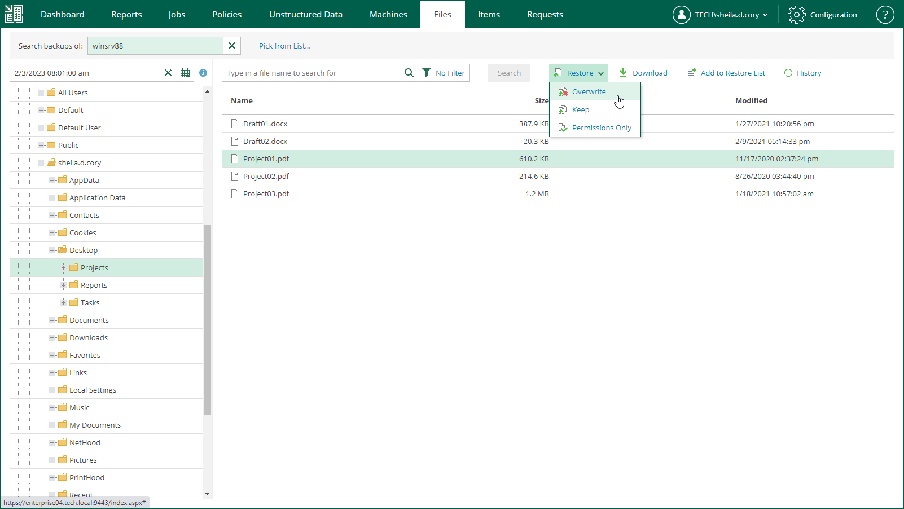

# Restoring Files to Original Location

In this restore scenario, Veeam Backup Enterprise Manager extracts file system objects (files or folders) from the backup and restores it to the original production machine. File restore to the original location is the most secure file recovery method, as the user who initiates the file restore operation in the Veeam Backup Enterprise Manager web UI cannot access the file itself.

|  |
| --- |
| Important |
| Consider the following:   * This type of restore is only possible if the original machine is powered on and resides in the original location. * By default, guest file restore to the original location is performed using the account specified in the backup job for guest OS access. If it does not have sufficient rights to access the target machine, you are prompted for the credentials. Specify user account and password, as required. For more information, see [Guest OS Credentials](em_guest_os_credentials.md). |

To restores objects to the original location, do the following:

1. Find the objects you want to restore. You can select one or multiple objects. For details, see [Browsing Machine Backups for Guest OS Files](browsing_vm_backups.md) and [Searching for Guest OS Files in Machine Backups](searching_vm_backups.md).
2. Click Restore and choose how to restore the selected objects:

* If you select Overwrite, the object from the backup will replace the original object on the target machine.
* If you select Keep, the object from the backup will be restored next to the original object on the target machine. The restored object will have the \_RESTORED\_<DATE>\_<TIME> prefix in its name, where <DATE>\_<TIME> is the restore date and time.
* [For Microsoft Windows] If you select Permissions Only, you will restore file (or folder) permissions that were granted to users and groups to access the object. You can restore permissions only if the object exists on the target machine.

1. In the displayed window, click Yes.

Veeam Backup Enterprise Manager will start the restore operation and display the progress and result of the operation in the File Restore History view.

