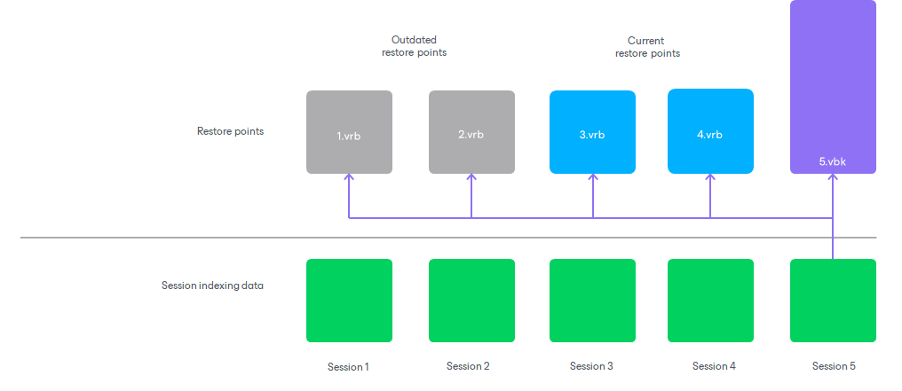

# Retention for Reverse Incremental Backups

For reverse incremental backup chains, Veeam Backup Enterprise Manager keeps more indexing data in Veeam Backup Catalog than it may seem to be required according to the retention policy. This happens due to backward nature of reverse incremental backups.

When Veeam Backup Enterprise Manager deletes indexing data by retention, it removes the whole set of files: machine indexing data and session indexing data. Before removing indexing data for a specific machine restore point, Veeam Backup Enterprise Manager makes sure that this restore point is not referenced by any of backup job sessions:

* If no relations are detected, indexing data for this machine restore point is removed from Veeam Backup Catalog.
* If the machine restore point is referenced by any backup job session, indexing data for this machine restore point remains in Veeam Backup Catalog.

However, in reverse incremental chains, session indexing data references the machine restore point that was created in the backup job sessions, and restore points preceding it. To learn more, see [Indexing Data](indexing_data.md#session_index).

For this reason, Veeam Backup Enterprise Manager retains more indexing data for reverse incremental chains. The retention period is calculated by the following formula:

Retention period = MAX (Catalog Retention, X) + X

where:

* Catalog Retention is the retention period specified in Veeam Backup Enterprise Manager.
* X is the amount of time for which restore points are kept by a backup job.

For example, the retention policy settings are specified in the following manner:

* The retention policy for the backup job is set to 3 points. The backup job is run daily.
* The retention period in Veeam Backup Enterprise Manager is set to 1 month, or 30 days.

In this case, Veeam Backup Enterprise Manager will retain in Veeam Backup Catalog indexing data for 30 days plus indexing data for 3 restore points in the backup chain.

|  |
| --- |
| Important |
| The longer the backup chain, the more indexing data is stored in Veeam Backup Catalog.  In case of long backup chains, indexing data may take a lot of space on the Veeam Backup Enterprise Manager server. To overcome this situation, you can adjust the retention policy scheme or provide enough space for indexing data in Veeam Backup Catalog on Veeam Backup Enterprise Manager. |

