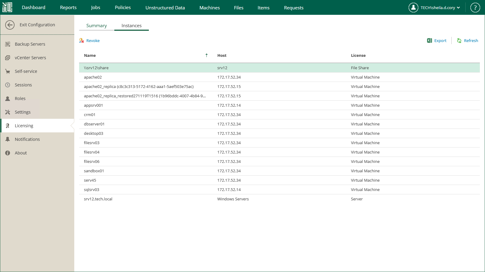

# Revoking License

You can use Enterprise Manager to revoke instances from machines — that is, reclaim the instance used for a machine to apply it to another machine.

To revoke the license, take the following steps:

1. Sign in to Veeam Backup Enterprise Manager using an account with the Portal Administrator role.
2. To open the Configuration view, click Configuration in the upper-right corner.
3. In the Configuration view, open the Licensing section.
4. Select the Instances tab.
5. Select the required object in the list and click Revoke.

