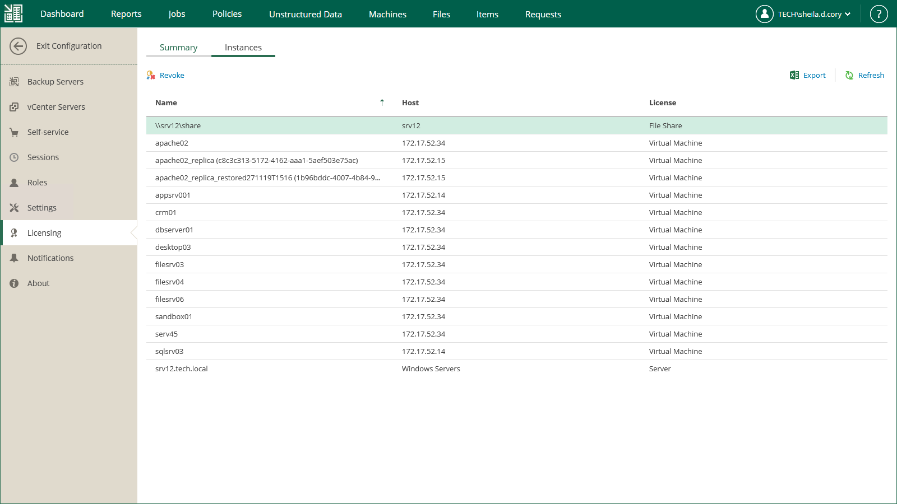

# Revoking License

You can use Enterprise Manager to revoke instances from machines — that is, reclaim the instance used for a machine to apply it to another machine.

To revoke the license, take the following steps:

1. Sign in to Veeam Backup Enterprise Manager using an account with the Portal Administrator role.
2. In the upper-right corner, click Configuration.
3. In the Configuration view, open the Licensing section.
4. Select the Instances tab.
5. Select the required object in the list and click Revoke.

Page updated 2026-07-16

