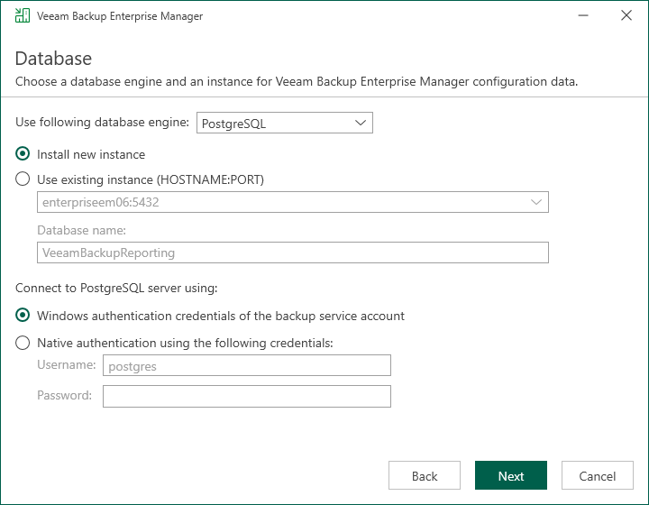
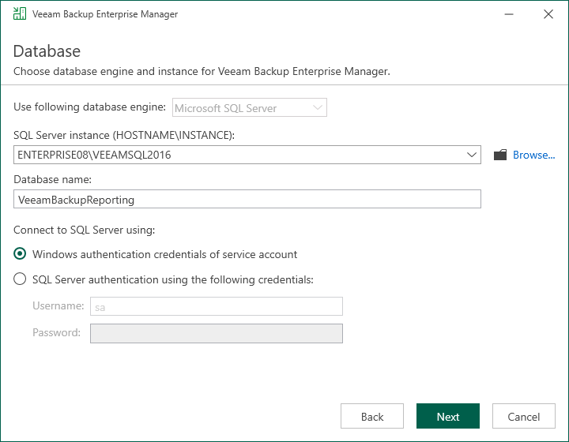

# Step 8. Specify Database Server

The Database step of the wizard is available if you have selected to configure installation settings manually.

At this step of the wizard, you can choose a database engine (Microsoft SQL Server or PostgreSQL) for the Enterprise Manager configuration database, specify a new or existing instance where you want to deploy the configuration database, and specify the authentication mode.

|  |
| --- |
| Note |
| Configuration databases of the Enterprise Manager server and backup servers added to the Enterprise Manager infrastructure must use the same database engine. |

1. Select one of the following database engines that you want to use for the configuration database:

* PostgreSQL
* Microsoft SQL Server

1. Specify instance settings:

* [For PostgreSQL] You can use an existing PostgreSQL instance or create a new one.

* To create a new PostgreSQL instance, select the Install new instance option. The setup will install PostgreSQL on the Enterprise Manager server and create a database with the VeeamBackupReporting name.
* To use an existing PostgreSQL instance, select the Use existing instance option. Enter the instance name in the HOSTNAME:PORT format. In the Database name field, specify a name for the Enterprise Manager configuration database.

|  |
| --- |
| Important |
| If you want to use an existing PostgreSQL instance, make sure that the instance can use sufficient resources. For more information, see [Configuring PostgreSQL Instance](em_installation_byb.md#ConfiguringPostgreSQLInstance). |

* [For Microsoft SQL Server] You can use an already installed Microsoft SQL Server database only.

1. In the SQL Server instance field, enter the instance name in the HOSTNAME\INSTANCE format or select an instance from the drop-down list. You can also click Browse to choose a Microsoft SQL Server on a remote machine.
2. In the Database name field, specify a name for the Enterprise Manager configuration database.

1. Select an authentication mode to connect to the database server instance: Microsoft Windows authentication or native database server authentication. If you select the native authentication, enter credentials of the database account.

If a configuration database with the specified name already exists (for example, it was created by a previous installation of Enterprise Manager), the setup wizard will notify about it. To connect to the detected database, click Yes. If necessary, Enterprise Manager will automatically upgrade the database to the latest version.

