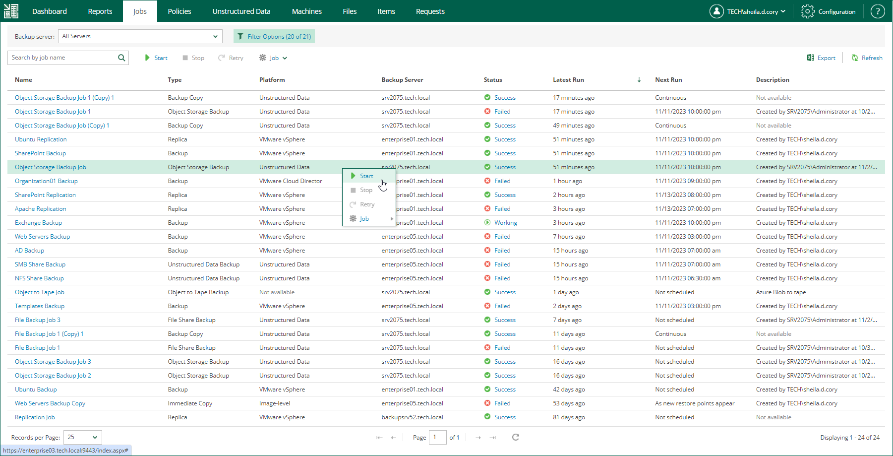

In this article

Users with the Portal Administrator role can control backup and replication jobs without the need to access the Veeam Backup & Replication console on the backup server.

On the Jobs tab, you can start, stop or retry a job.

* To start a job, select the job from the list and click Start.
* To stop a job, select the job from the list and click Stop.
* To retry a failed job, select the job from the list and click Retry.

|  |
| --- |
| Note |
| * For more information on starting a backup copy job, see the [Starting and Stopping Backup Copy Jobs](https://helpcenter.veeam.com/docs/vbr/userguide/backup_copy_manual_start_stop.html?ver=13) section of the Veeam Backup & Replication User Guide. * For more information on starting and stopping a Microsoft SQL Server, Oracle or PostgreSQL backup job with transaction log processing enabled, see the [Starting and Stopping Transaction Log Backup Jobs](https://helpcenter.veeam.com/docs/vbr/userguide/starting_transaction_log_jobs.html?ver=13) section of the Veeam Backup & Replication User Guide. |

Page updated 11/26/2024

Page content applies to build 13.0.1.1071
