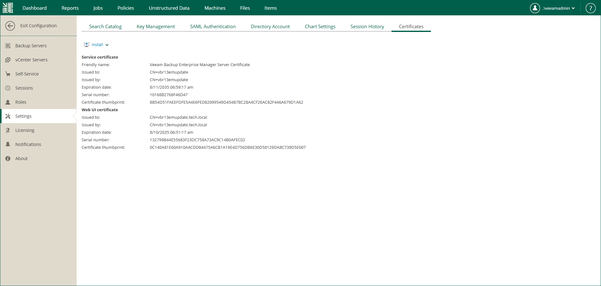

In this article

TLS certificates ensure a secure connection with Veeam Backup Enterprise Manager over HTTPS. By default, Veeam Backup Enterprise Manager uses the same TLS certificate for all connections. If you want to use different certificates for different components, you can install new certificates. For more information, see [Installing Certificates](updating_security_certificate.md). The certificate is bound to Enterprise Manager, the REST API and their ports.

* During the Enterprise Manager installation on Linux, a self-signed certificate is generated.
* During the Enterprise Manager installation on Microsoft Windows, you can select an existing certificate or generate a new self-signed certificate.

TLS certificates are used for the following purposes:

* The Veeam Backup Enterprise Manager Service and Veeam Guest Catalog Service use the server certificate to communicate with backup servers added to the Enterprise Manager infrastructure. For more information, see [How Enterprise Manager Authenticates to Backup Servers](connecting_to_backup_servers.md). The same certificate is used by the Veeam Backup Enterprise Manager REST API Service to communicate with REST API clients.
* The Veeam Backup Enterprise Manager web application and Veeam vSphere Client plug-in use the web UI certificate to communicate with a browser.

Page updated 12/15/2025

Page content applies to build 13.0.1.1071
