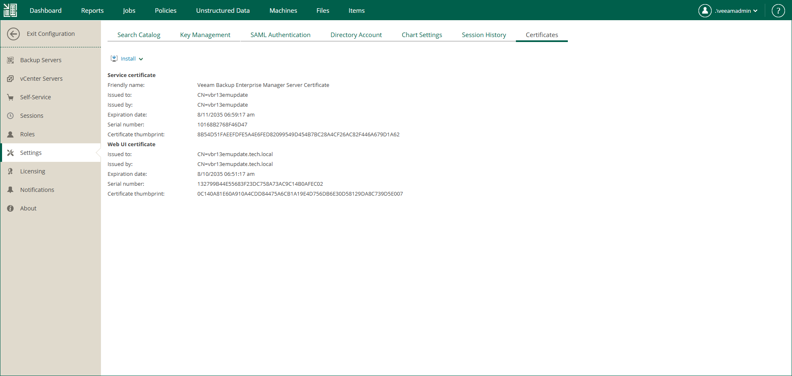

# Managing TLS Certificates

TLS certificates ensure a secure connection with Veeam Backup Enterprise Manager over HTTPS. By default, Veeam Backup Enterprise Manager uses the same TLS certificate for all connections. If you want to use different certificates for different components, you can install new certificates. For more information, see [Installing Certificates](updating_security_certificate.md). The certificate is bound to Enterprise Manager, the REST API and their ports.

* During the Enterprise Manager installation on Linux, a self-signed certificate is generated.
* During the Enterprise Manager installation on Microsoft Windows, you can select an existing certificate or generate a new self-signed certificate.

Enterprise Manager use the following certificates:

* Server certificate is used by the Veeam Backup Enterprise Manager Service and Veeam Guest Catalog Service to communicate with backup servers added to the Enterprise Manager infrastructure. For more information, see [How Enterprise Manager Authenticates to Backup Servers](connecting_to_backup_servers.md). The same certificate is used by the Veeam Backup Enterprise Manager REST API Service to communicate with REST API clients.
* Web UI certificate is used by the Veeam Backup Enterprise Manager web application, Veeam Plug-in for VMware vSphere Client, and Veeam Plug-in for VMware Cloud Director to communicate with the web browser.

