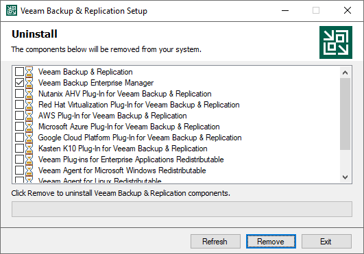

In this article

When you uninstall Veeam Backup Enterprise Manager, only the application itself is removed. The Enterprise Manager configuration database (the default name is VeeamBackupReporting) and all configuration data that is stored in the database remain. This lets you install Enterprise Manager again and use the preconfigured settings. If you are not going to reuse the Enterprise Manager configuration, you can delete the database manually.

The Enterprise Manager server is also recorded in configuration databases of added backup servers, which binds the backup servers to the Enterprise Manager server. If you are not going to use Enterprise Manager on this or another machine, it is recommended that you unbind the backup servers by removing them from Enterprise Manager before you uninstall the application. For more information, see [Removing Backup Servers](removing_backup_server.md).

To uninstall Veeam Backup Enterprise Manager:

1. From the Start menu, select Control Panel > Programs and Features.
2. In the programs list, right-click Veeam Backup & Replication and select Uninstall.
3. In the Uninstall window, make sure the check box next to Veeam Backup Enterprise Manager is selected. If this component is co-installed with the Veeam Backup & Replication server, make sure the check box next to Veeam Backup & Replication is cleared. Click Remove and wait for the process to complete.

Page updated 11/10/2025

Page content applies to build 13.0.1.1071
