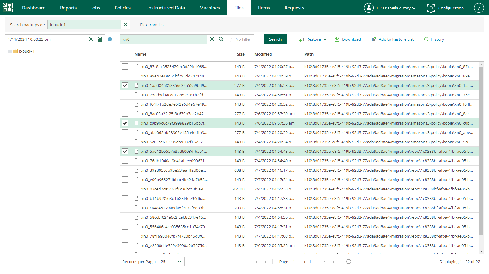

In this article

Veeam Backup Enterprise Manager allows you to search unstructured data (file shares and object storage systems) for specific items. After you find necessary files, you can select them to perform file restore.

|  |
| --- |
| Important |
| When you back up unstructured data, file system indexing is not created. Therefore, advanced search capabilities using filters are not available. |

To perform simple search, do the following:

1. On the Unstructured Data tab, select a data source and click Restore.

Alternatively, on the Files tab, in the Search backups of field, enter the name of a data source whose items you want to browse or click the Pick from List link and select a data source in the Select Object window. Then click Mount.

1. In the Search backups of field, enter the name of a data source whose items you want to restore or click the Pick from List link and select the necessary data source in the Select Object window.
2. In the search field, enter the name of the necessary item or a part of it.
3. To view the search results, press [Enter] or click Search.

Page updated 12/20/2024

Page content applies to build 13.0.1.1071
