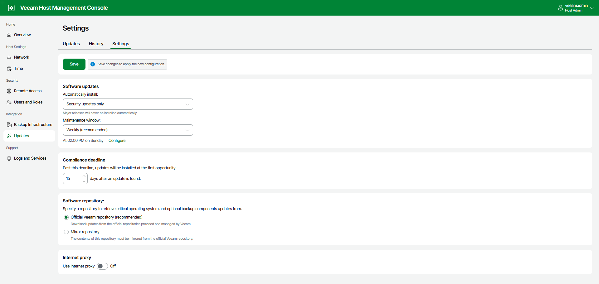

In this article

To set up Veeam Software Appliance updates, perform the following steps:

1. Log in to the Veeam Host Management console.
2. In the management pane, click Updates.
3. On the Settings tab, configure the following settings:

* Updates for automatic installation. By default, only security updates are installed automatically. You can also include optional updates, except for major releases.
* Maintenance window. You can schedule automatic update installation to run on a weekly or monthly basis. If you want to install updates manually, select None.
* Compliance deadline. By default, updates you selected for automatic installation are forcibly installed after 30 days. You can postpone this operation up to 90 days.

The date of the first found update is used as the start date for calculating compliance deadline. When the compliance deadline is reached, Veeam Updater installs all available updates selected for automated installation.

|  |
| --- |
| Important |
| Consider the following:   * If you select manual installation in the maintenance window, mandatory updates will be still automatically installed when the compliance deadline is reached. * If you schedule automatic update installation or miss the compliance deadline, updates will be installed even if you have running jobs. Recovery operations performed by these jobs will fail. |

* Software repository. By default, updates are installed from the Veeam official repository (https://repository.veeam.com/vsa). If your backup server does not have internet access, you can specify a local mirror of the Veeam repository, for example, https://repository.tech.local. For the HTTPS repository, you also need to specify a certificate.
* Internet proxy. Add a proxy server if you use one.

1. Click Save.

Page updated 12/16/2025

Page content applies to build 13.0.1.1071
