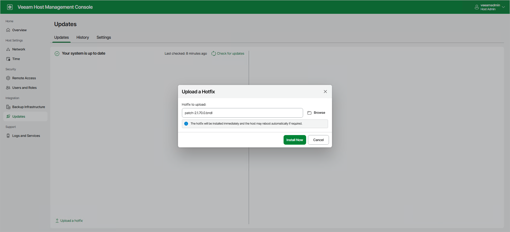

# Installing Updates

Updates can be installed manually or automatically. For more details on the installation process, see [How Updates Work](update_appliance_hiw.md).

Installing Updates Manually

To install updates manually, perform the following steps:

1. Log in to the Veeam Host Management console installed on Veeam Backup Enterprise Manager.
2. In the management pane, click Updates.
3. On the Updates tab, select updates that you want to install. To view detailed information about changes included in updates, click What's new?. For optional updates, a license agreement is also displayed if applicable.
4. Select the action:

* To install updates immediately, click Install Updates Now and confirm the operation.
* To schedule update installation, set up the schedule and click Schedule Updates.

Installing Updates Automatically

To install updates automatically, set up the maintenance window in the update configuration. For more information, see [Configuring Updates](update_appliance_configure_updates.md).

|  |
| --- |
| Note |
| If automatic update installation fails, Veeam Updater will try to install updates again at the same day with the following intervals: in 1 minute, 10 minutes, 1 hour, 3 hours, 6 hours, and 12 hours. If these attempts are not successful, Veeam Updater will retry update installation once a day for the next 6 days and then repeats the retry cycle from the 1 minute interval. |

Installing Private Hotfixes

If you get a private hotfix provided by Veeam, you can install it manually. To do this, perform the following steps:

1. Make sure that you do not have running jobs. Otherwise, recovery operations performed by these jobs will fail.
2. Log in to the Veeam Host Management console installed on Veeam Backup Enterprise Manager.
3. In the management pane, click Updates.
4. On the Updates tab, click Upload a hotfix.
5. Select the file and click Upload.

1. After the file is uploaded, click Install Now. If a hotfix has a license agreement, you need to agree with it before the installation process starts.

