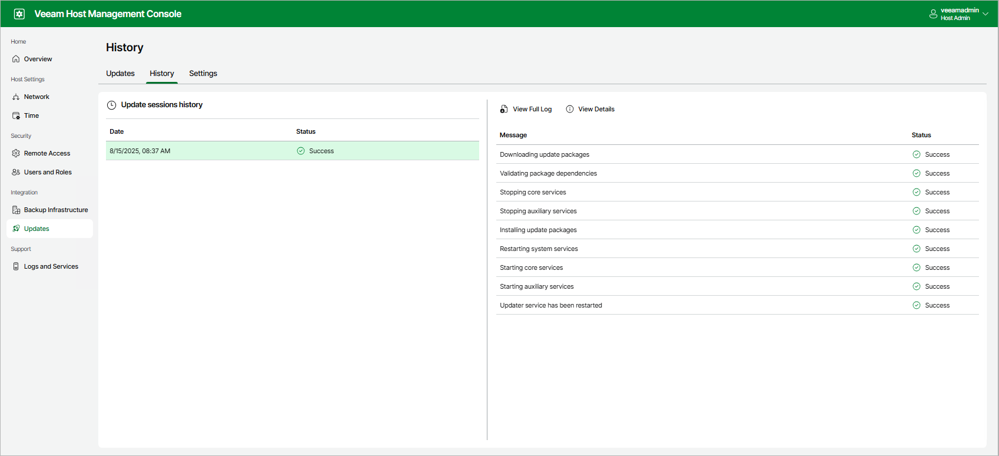

In this article

To view detailed information about update sessions, do the following:

1. Log in to the Veeam Host Management console.
2. In the management pane, click Updates.
3. On the History tab, select the date to view update events.
4. Click View Details.

To download a full log file, click View Full Log.

Page updated 10/8/2025

Page content applies to build 13.0.1.1071
