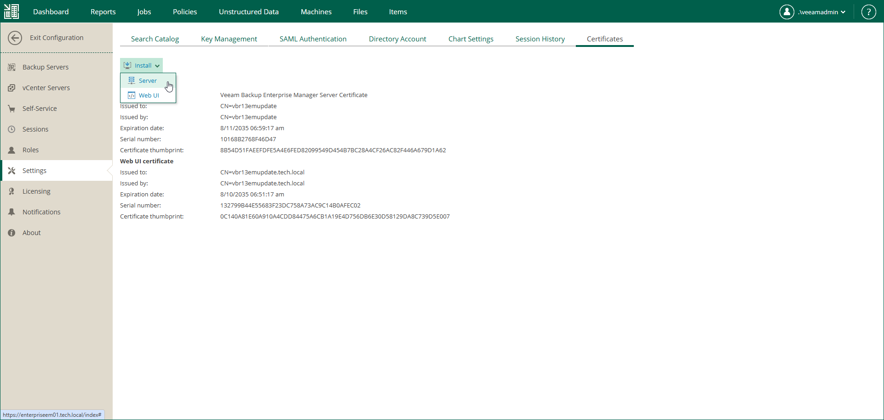
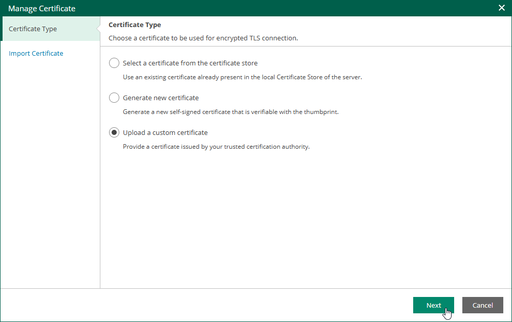

In this article

If an existing TLS certificate expires, or if you want to replace it (for example, with a certificate obtained from a Certificate Authority) you can install a new certificate. When using a certificate obtained from a CA, ensure that the Enterprise Manager IP address or fully qualified domain name is included in the certificate subject or subject alternative name.

If you plan to use a certificate signed by an internal Certificate Authority (CA), add the certificate to the certificate store before starting the installation. For details, see [Using Certificate Signed by Internal CA](em_tls_internal_ca.md).

|  |
| --- |
| Note |
| For Microsoft Windows-based Enterprise Manager, to update the certificate used by the Enterprise Manager web application and Veeam vSphere Client plug-in, you can also use Internet Information Services (IIS) Manager as an alternative method. For more information, see [this Microsoft Docs article](https://technet.microsoft.com/en-us/library/cc732230%28v%3Dws.10%29.aspx). |

To install a new certificate, follow these steps:

1. Log in to Enterprise Manager using an administrative account.
2. To open the Configuration view, click Configuration in the upper-right corner.
3. Open the Settings section.
4. On the Certificates tab, click Install and then choose the type of certificate to install:

* Select Server to install the certificate used by the Veeam Backup Enterprise Manager Service and Veeam Guest Catalog Service to connect to backup servers. This certificate will also be used by the Veeam Backup Enterprise Manager REST API.

* Select Web UI to install the certificate used by the Veeam Backup Enterprise Manager web app and Veeam vSphere Client plug-in to connect to the web browser.

1. At the Certificate Type step of the Manage Certificate wizard, select one of the following options:

* Select a certificate from the certificate store

* Generate new certificate
* Upload a custom certificate

1. At the next step step of the wizard either provide a certificate friendly name for a self-signed certificate or choose an existing certificate that you want to install.

1. To install the certificate, click Finish.

Page updated 12/17/2025

Page content applies to build 13.0.1.1071
