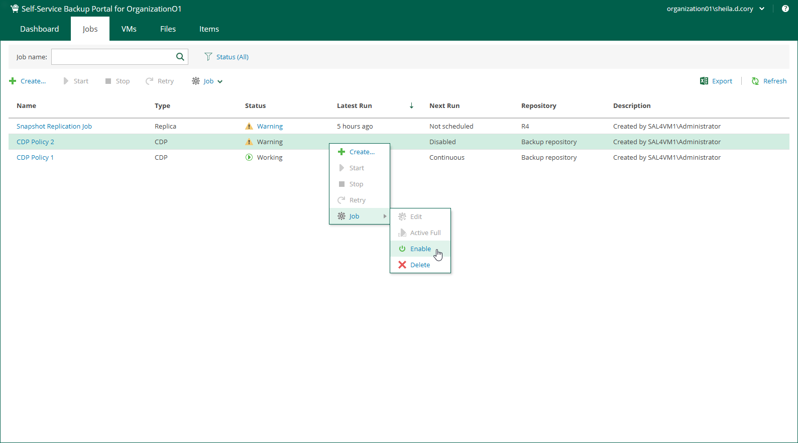

In this article

Members of a VMware Cloud Director organization can enable and disable organization backup jobs, replication jobs and CDP policies. Disabled jobs and policies are temporary paused.

To enable or disable a policy:

1. On the Jobs tab, select a job or policy from the list.
2. On the toolbar, click Enable or Disable.

Alternatively, you can right-click a job or policy and select Job > Enable.

Page updated 11/26/2024

Page content applies to build 13.0.1.1071
