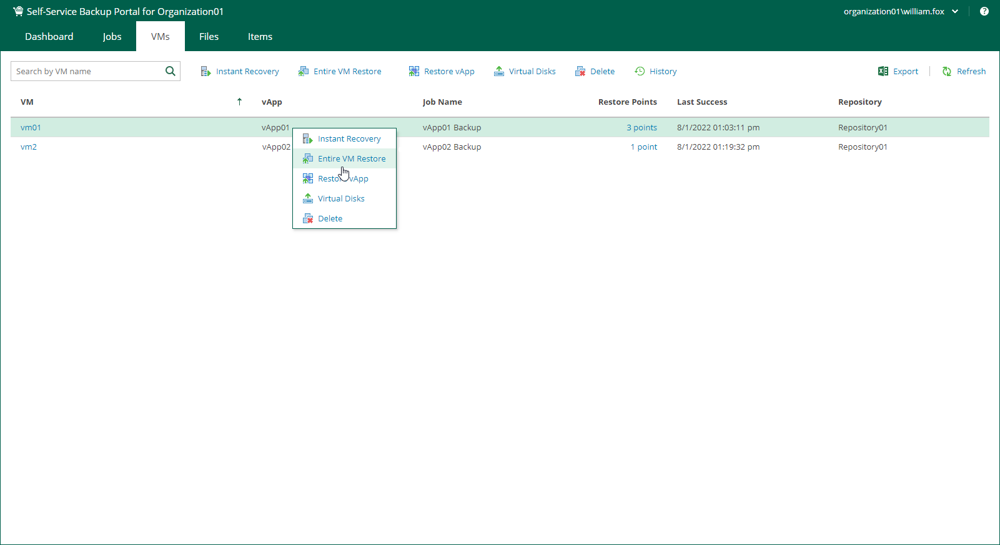

# Entire VM Restore

You can restore VMware Cloud Director VMs from backups to the original vApp or another vApp that belongs your VMware Cloud Director organization.

To restore an entire VM, do the following:

1. On the VMs tab, select a VM you want to restore. To quickly find the necessary VM, use the search field at the top of the window.
2. On the toolbar, click Entire VM Restore.

Alternatively, you can right-click the VM and select Entire VM Restore.

1. Follow the steps of the Entire VM Restore wizard. For more information, see [Restoring Entire VM to VMware Cloud Director](entire_vm_restore_vcd_perform.md).

