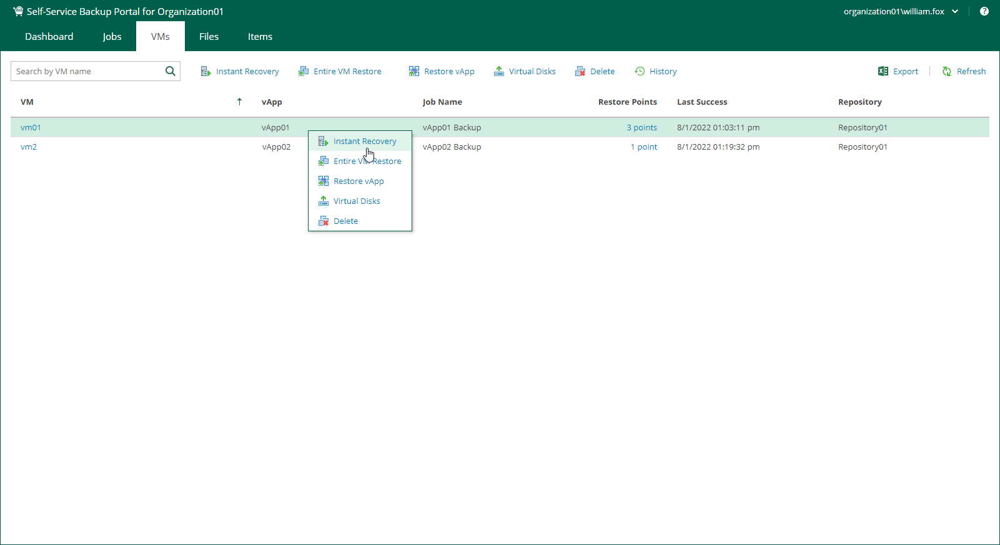

In this article

You can instantly recover VMware Cloud Director VMs from backups to the original vApp or another vApp that belongs your VMware Cloud Director organization.

To instantly recover a VM, do the following:

1. On the VMs tab, select a VM you want to recover. To quickly find the necessary VM, use the search field at the top of the window.
2. On the toolbar, click Instant Recovery.

Alternatively, you can right-click the VM and select Instant Recovery.

1. Follow the steps of the Instant Recovery wizard. For more information, see [Instant Recovery to VMware Cloud Director](instant_recovery_vcd.md).

Page updated 11/26/2024

Page content applies to build 13.0.1.1071
