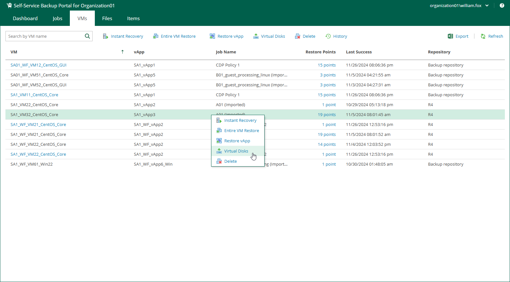

In this article

You can restore individual virtual disks from backups of VMware Cloud Director VMs.

To restore a virtual disk:

1. On the VMs tab, select a VM with disks you want to restore. To quickly find the necessary VM, use the search field at the top of the window.
2. Click Virtual Disks.
3. Follow the steps of the Virtual Disk Restore wizard. For details, see [Virtual Disk Restore](em_disk_restore.md).

Page updated 12/2/2024

Page content applies to build 13.0.1.1071
