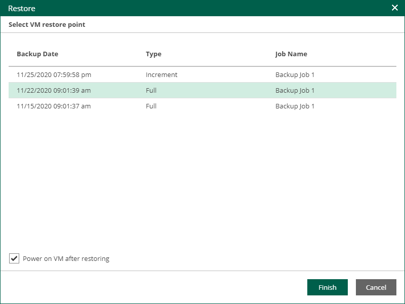

# Restoring vApps

You can restore a vApp to the original (production) VDC.

To restore a vApp:

1. On the VMs tab, select a vApp. To quickly find the necessary vApp, use the search field at the top of the window.
2. Click Restore vApp and select the option you need:

* Select Overwrite if you want to restore the vApp from the backup to the original VDC, replacing the production vApp.
* Select Keep if you want to keep the original vApp in the original VDC. The vApp from the backup will be located next to the original production vApp and will have the same name with the \_restored suffix. Names of VMs in the vApp will remain the same.

1. Select the restore point that will be used to restore the vApp.
2. [Optional] To start VMs in the restored vApp immediately after recovery, select Power on VM after restoring.

1. Click Finish.
2. Click Yes in the message window to confirm the operation.

To view the VM restore progress, on the Machines tab, click History.

|  |
| --- |
| Important |
| Restore job of a vApp with a standalone VM will return an ordinary and not standalone VM. |

