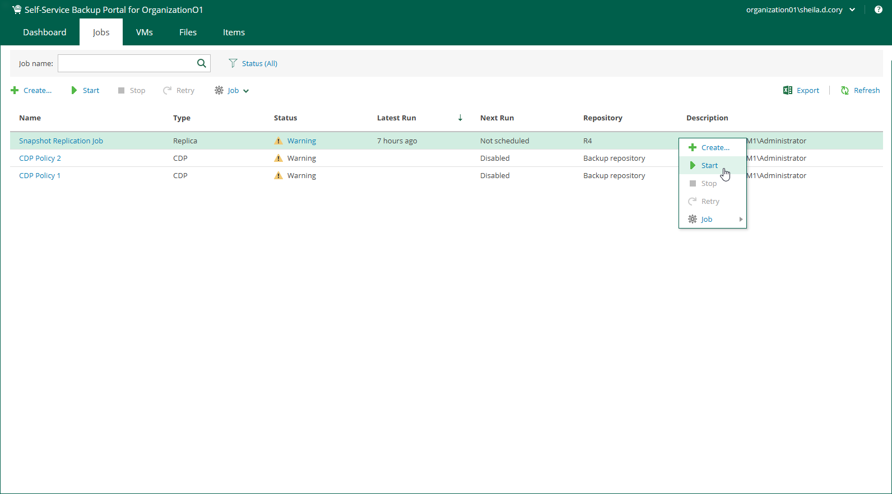

In this article

Members of a VMware Cloud Director organization can start, stop and retry organization backup jobs and replication jobs.

* To start a job, right-click a job from the list and select Start.
* To stop a job, right-click a job from the list and select Stop.
* To retry a failed job, right-click a job from the list and select Retry.

Page updated 11/26/2024

Page content applies to build 13.0.1.1071
