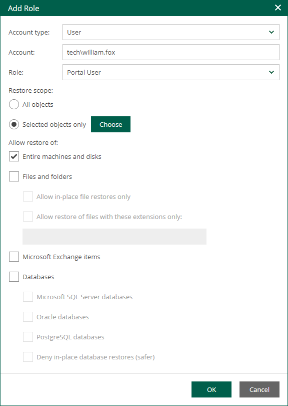
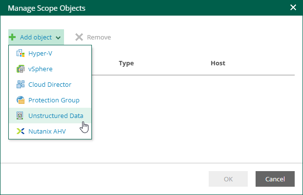

# Configuring Restore Scope

Restore scope is a list of objects (machines and file shares) that can be recovered by appropriate users. By default, the restore scope for users with a non-administrative role (Portal User and Restore Operator) includes all objects from available backups. If you have the Enterprise Plus edition of Veeam Backup & Replication, you can customize the restore scope.

To customize the restore scope, perform the following steps when adding or editing a Portal User or Restore Operator account:

1. Log in to Enterprise Manager using an administrative account.
2. To open the Configuration view, click Configuration in the upper-right corner.
3. Select the Roles section on the left of the Configuration view.
4. Click Add to add an account, or select an existing account and click Edit.
5. In the Restore scope section, select the Selected objects only option and click Choose.

1. In the Manage Scope Objects window, click Add object and select what type of objects to display. You can select from the following types: Hyper-V, vSphere, Cloud Director, Protection Group, Unstructured Data or Nutanix AHV.

1. In the Add Objects window, select the objects you allow the user to restore. Consider that reverse DNS lookup on the Veeam Backup Enterprise Manager server must be functional. Otherwise, the Add Objects window may display incomplete infrastructure.

To search for an object, type a name or its part in the search field. Specify the type of the object from the drop-down list next to the search field.

You can also use the buttons in the upper-right corner to switch between virtual infrastructure views:

* For Microsoft Hyper-V objects, you can switch between the Hosts and VMs, Hosts and Volumes, and Hosts and VM Groups views.
* For VMware vSphere objects, you can switch between the Hosts and Clusters, VMs and Templates, Datastores and VMs and Tags and VMs views.
* For VMware Cloud Director, protection groups, unstructured data and Nutanix AHV, switching the views is not available.

1. Click OK to save the settings.

After the users log in to Enterprise Manager, they will be able to view objects included in their restore scope.

|  |
| --- |
| Note |
| The Machines and Unstructured Data tabs display only machines and unstructured data (file shares and object storage systems) that have been backed up. The Files tab displays guest OS files only for machines that have been backed up with guest file indexing enabled. For more information on indexing, see [Preparing for File Browsing and Searching](preparing_for_file_browsing.md). |

Restore scope is automatically refreshed daily on built-in schedule and after any role modification. It may happen that some newly created machines, file shares and backups are not yet presented to users in the Machines, Unstructured Data or Files tabs right after the login to Enterprise Manager. If you cannot find an object after making a search query, click the I don’t see my VM link to refresh the view. This link, however, is not visible until you get unsuccessful search results.

Users with the Portal Administrator role can click Rebuild Roles to refresh all scopes of all accounts manually. This operation will affect all configured roles. You can watch the progress of the security scope rebuild in the Sessions section.

