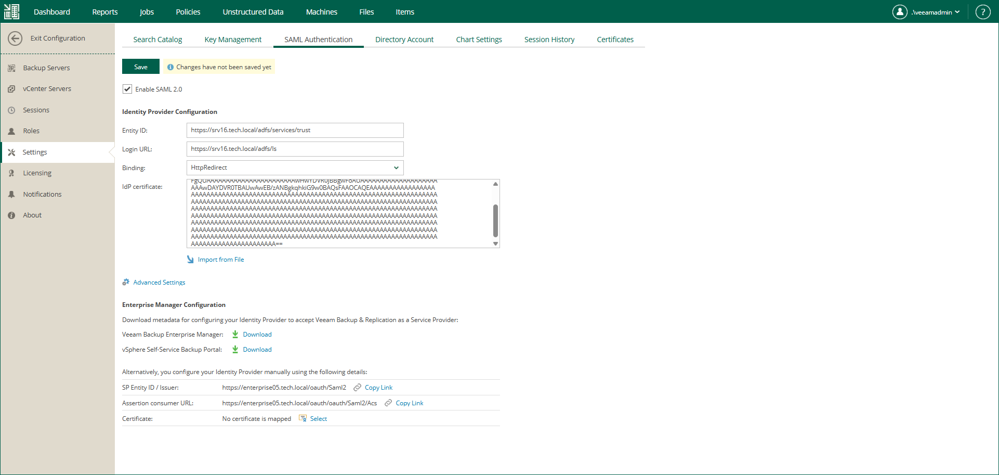
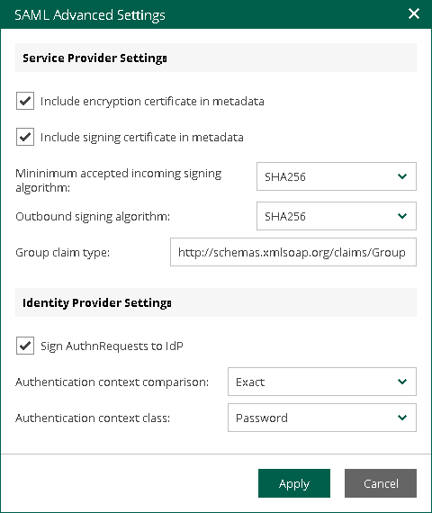

In this article

Organizations who use single sign-on (SSO) in their IT infrastructure can allow users to access the Veeam Backup Enterprise Manager website and vSphere Self-Service Backup Portal with their SSO credentials. To do this, the Enterprise Manager administrator must configure SAML authentication settings.

|  |
| --- |
| Note |
| If SAML authentication is enabled, users can log in to vSphere Self-Service Backup Portal under SSO accounts only. |

To configure SAML authentication settings:

1. Log in to Enterprise Manager using an administrative account.
2. To open the Configuration view, click Configuration in the upper-right corner.
3. Open the Settings section on the left of the Configuration view.
4. Click the SAML Authentication tab.
5. Select the Enable SAML 2.0 option.
6. In the Identity Provider Configuration section, specify identity provider settings. For more information, see [Specifying Identity Provider Settings](#idp).
7. [Optional] If you want to use a certificate to encrypt and sign service provider SAML requests, specify certificate settings. For more information, see [Selecting Service Provider Certificate](#spcert).
8. [Optional] Click the Advanced Settings link and specify advanced SAML authentication settings. For more information, see [Specifying Advanced SAML Authentication Settings](#advanced).
9. In the Enterprise Manager Configuration section, export or manually copy metadata of the service provider (the Veeam Backup Enterprise Manager website, vSphere Self-Service Backup Portal, or both) for which you configure SSO. Use the metadata to register the service provider on the identity provider side. For more information, see [Obtaining Service Provider Settings](#sp).
10. Click Save.

After you configure SAML authentication settings, you can register user accounts that will be able to log in to the Veeam Backup Enterprise Manager website or vSphere Self-Service Backup Portal using SSO. For more information, see [Configuring Accounts and Roles](veeam_backup_em_roles.md) and [Managing Tenant Accounts](em_managing_tenants.md).

Specifying Identity Provider Settings

To set up SAML authentication, you must obtain SAML authentication settings from the identity provider and specify them in Enterprise Manager. You can specify identity provider settings in one of the following ways:

* Import identity provider settings from a SAML metadata file obtained from the identity provider.
* Specify identity provider settings manually.

To import identity provider settings from the SAML metadata file, in the Identity Provider Configuration section of the SAML Authentication view, click the Import from File link and browse to the metadata file. The metadata file structure must conform to the [SAML 2.0 Metadata Schema](http://docs.oasis-open.org/security/saml/v2.0/saml-schema-metadata-2.0.xsd).

Alternatively, you can specify identity provider settings manually:

1. In the Identity Provider Configuration section, in the Entity ID field, specify a unique ID of the identity provider.
2. In the Login URL field, specify the URL of the single sign-on login page provided by the identity provider.
3. From the Binding list, select a SAML binding used by the identity provider to send SAML responses: HttpRedirect or HttpPost.
4. In the IdP certificate field, specify a certificate that will be used to validate the signature of the signed authentication assertions and decrypt assertions sent by the identity provider.

|  |
| --- |
| Note |
| Veeam Backup Enterprise Manager does not support identity provider certificate rollover. |

Selecting Service Provider Certificate

If you want to sign and encrypt authentication requests sent from Veeam Backup Enterprise Manager to the identity provider, you must select a certificate with a private key that will be used for encryption and signing. To select a certificate:

1. In the Enterprise Manager Configuration section of the SAML Authentication view, click the Select link next to the Certificate field.
2. In the Select Service Provider Certificate window, Veeam Backup Enterprise Manager will display certificates located in the certificate store on the Enterprise Manager server. Choose the necessary certificate from the list and click Select.

If you use a certificate to sign end encrypt SAML authentication requests, you must pass the public key certificate to the identity provider. The identity provider will use this certificate to encrypt requests and validate the request signature. For more information, see [Obtaining Service Provider Settings](#sp).

|  |
| --- |
| Tip |
| Consider the following:   * To change the service provider certificate, click the Remove link next to the Certificate field. Then select another certificate from the certificate store. * You can choose whether to include the certificate in the service provider metadata. For more information, see [Specifying Advanced SAML Authentication Settings](#advanced). |

Specifying Advanced SAML Authentication Settings

In the SAML Advanced Settings window you can specify advanced settings for SAML authentication.

1. To include in the service provider SAML metadata a security certificate required to decrypt service provider authentication requests, select the Include encryption certificate in metadata check box.
2. To validate the signature of the signed requests, select the Include signing certificate in metadata check box.
3. From the Minimum accepted incoming signing algorithm and Outbound sign algorithm lists, select what type of signed requests and responses Enterprise Manager will be able to send and receive. By default, the SHA256 option is selected. With this option selected, Enterprise Manager will send and receive requests and responses signed using the SHA256 or stronger algorithm.
4. By default, to provide for single sign-on authentication for groups of users, Veeam Backup Enterprise Manager accepts information about groups from the identity provider in statements of the Group type. If it is required to use for this purpose statements of a different type, in the Group claim type field, specify the necessary type.
5. If you want to sign authentication requests sent from Enterprise Manager to the identity provider with a digital certificate, in the Identity Provider Settings section, select the Sign AuthnRequests to IdP check box.
6. From the Authentication context comparison list, select a comparison method for authentication context: Exact, Minimum, Maximum or Better.
7. From the Authentication context class list, select one of the classes to specify an authentication method used by the Identity Provider. By default, the Password option is selected. For details on authentication context classes, see [Authentication Context for the OASIS Security Assertion Markup Language (SAML) V2.0](https://docs.oasis-open.org/security/saml/v2.0/saml-authn-context-2.0-os.pdf).
8. Click Apply.

Obtaining Service Provider Settings

To set up SAML authentication for the Veeam Backup Enterprise Manager website and vSphere Self-Service Backup Portal, you need to register each of them individually as a service provider on the identity provider side. To do this, you need to obtain service provider settings and pass them to the identity provider.

You can obtain service provider settings in one of the following ways:

* [Export service provider settings to an XML file](#export)
* [Copy service provider settings](#copy)

Exporting Service Provider Settings

You can export settings of each service provider to a SAML metadata file — an XML file that conforms to the [SAML 2.0 Metadata Schema](http://docs.oasis-open.org/security/saml/v2.0/saml-schema-metadata-2.0.xsd). If you plan to use a certificate to sign end encrypt SAML authentication requests, and need to pass the public key certificate to the identity provider, you must include the certificate in the metadata file. For more information, see [Specifying Advanced SAML Authentication Settings](#advanced).

* To export service provider settings of the Veeam Backup Enterprise Manager website, click the Download link next to the Veeam Backup Enterprise Manager field.
* To export service provider settings of vSphere Self-Service Backup Portal, click the Download link next to the vSphere Self-Service Backup Portal field.

Copying Service Provider Settings

To copy service provider settings:

1. Copy the links next to the SP Entity ID / Issuer and Assertion consumer URL fields.
2. If you have selected a certificate that will be used to sign end encrypt SAML authentication requests, you must also pass the public key certificate to the identity provider. To copy the certificate, click the Download link next to the Certificate field.

Related Topics

[SAML Authentication Support](em_saml.md)

Page updated 11/19/2025

Page content applies to build 13.0.1.1071
