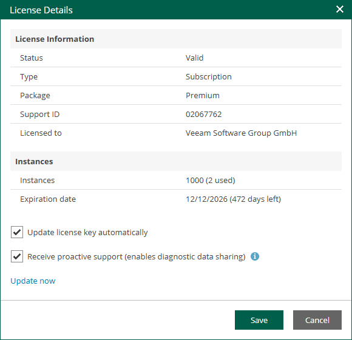

In this article

You can view information about the license edition, license state and a spreadsheet of the available and used instances per each type of protected workloads: Microsoft Entra tenants, virtual machines, physical servers and physical workstations, cloud machines, applications, file shares.

When you run a job, Enterprise Manager uses instances required for each type of protected workloads for per-instance licenses or applies a license to the protected hosts for per-socket licenses. If a workload is protected by multiple backup servers added to the Enterprise Manager infrastructure, the workload will consume the Enterprise Manager license only once.

For more information on Veeam licensing, see [Veeam Licensing Policy](https://www.veeam.com/availability-suite-faq.html).

To view license details:

1. Sign in to Veeam Backup Enterprise Manager under an account with the Portal Administrator role.
2. To open the Configuration view, click Configuration in the upper-right corner.
3. In the Configuration view, open the Licensing section.

|  |
| --- |
| Tip |
| You can configure Veeam Backup Enterprise Manager to send notifications about expiring license. For more information on the Veeam Backup Enterprise Manager notification functionality, see [Configuring Notification Settings](configuring_notification_settings.md). |

|  |
| --- |
| Note |
| Veeam Backup Enterprise Manager does not display information about instances consumed in the Veeam Cloud Connect service provider license by tenant workloads. This information is available only on the backup server of the service provider. For more information, see the [Licensing for Service Providers](https://helpcenter.veeam.com/docs/vbr/cloud/cloud_connect_licensing.html?ver=13) section of the Veeam Cloud Connect Guide. |

You can display detailed information about the current license, including license type, expiration date and the number of instances. To do this, click the Details link. To view information about license usage, click the Report link.

Page updated 11/10/2025

Page content applies to build 13.0.1.1071
