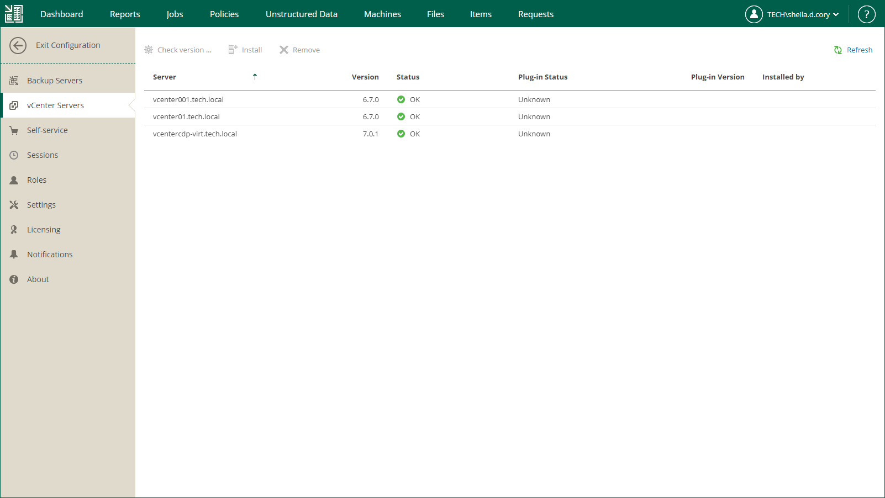

# Viewing vCenter Servers

On the vCenter Servers tab of the Configuration view, you can view information on vCenter Servers added to your Veeam backup infrastructure.

You can perform the following operations with vCenter Servers:

* Check version — use this command to request vCenter Server version and operation status. If Veeam Plug-in for VMware vSphere Client is deployed, its version, status and installation account will be also displayed.
* Install — use this command to install Veeam Plug-in for VMware vSphere Client on the selected server.
* Remove — use this command to uninstall Veeam Plug-in for VMware vSphere Client from selected server.

For more information on the plug-in, see [Veeam Plug-in for VMware vSphere Client](vsphere_plugin.md).

|  |
| --- |
| Important |
| To perform these operations, you should supply a user account with sufficient permissions to access vCenter Server. User account information is not imported from the Veeam Backup & Replication configuration database to the Enterprise Manager database for security reasons. |

