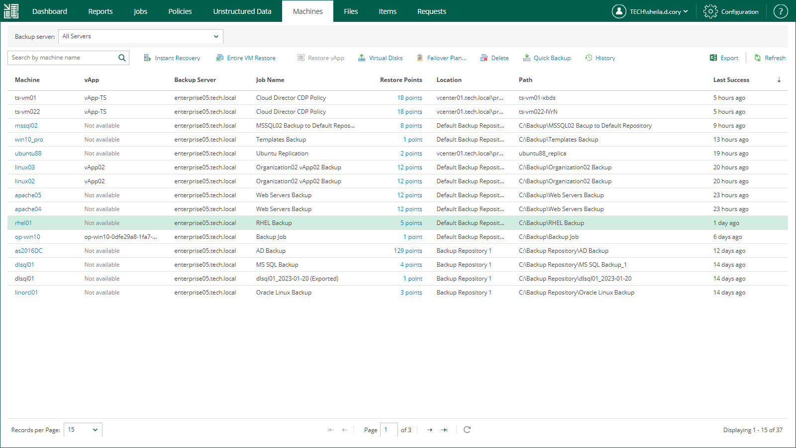
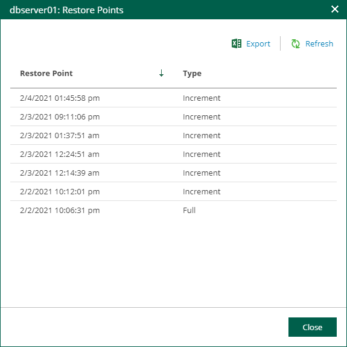

# Viewing Machines

On the Machines tab, you can view information about all machines engaged in performed jobs configured on backup servers.

|  |
| --- |
| Note |
| Veeam Backup Enterprise Manager does not display Nutanix AHV VMs, and recovery of Nutanix AHV VMs is not available. However, you can browse and restore guest OS files of Nutanix AHV VMs. For more information, see [Guest OS File Restore](searching_restoring_vm_guest_files.md). |

Entries in the list contain the following data:

* Machine name
* vApp name (for VMware Cloud Director VMs)
* Backup server that processes the machine
* Job name
* Number of restore points
* Path to backup files
* Last time when a restore point was successfully created

You can filter machines in the list by a backup server or search for specific machines by a machine name. To search for a machine, enter its name or part of the name in the Search field.

|  |
| --- |
| Note |
| You can export displayed information to a file using the Export link on the toolbar. This file then can be opened on the client machine using the associated application. |

Besides the information presented in the list of machines, the Machines tab allows you to view advanced data about each machine:

* To check a report containing a list of job runs for a specific machine, click the machine name in the Machine column.

Note, you cannot open a report for machines processed by backup copy jobs and machines from imported or orphaned backups.

* To open a list of machine restore points, click a link in the Restore Points column.

