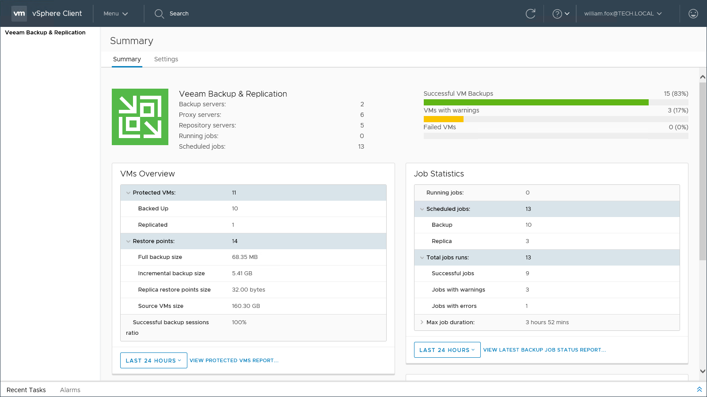

# Veeam Plug-in for VMware vSphere Client

Veeam Plug-in for VMware vSphere Client facilitates vSphere administrators’ daily routine of managing backup infrastructure in the organization. This plug-in allows authorized personnel to view detailed information on the status of the Veeam Backup & Replication infrastructure and create restore points ad-hoc, using no other tool but vSphere Client.

In particular, vSphere administrators can view success, warning and failure counts for all jobs, as well as cumulative information on used and available storage space, and statistics on processed VMs. They can easily identify unprotected VMs and perform capacity planning, as well as create restore points for selected VMs using VeeamZIP and Quick Backup functions, all directly from vSphere Client.

Veeam Plug-in for VMware vSphere Client is installed remotely on the Veeam Backup Enterprise Manager server. For more information, see [Veeam Plug-in for VMware vSphere Client Infrastructure](remote_vsphere_client_plugin.md).

