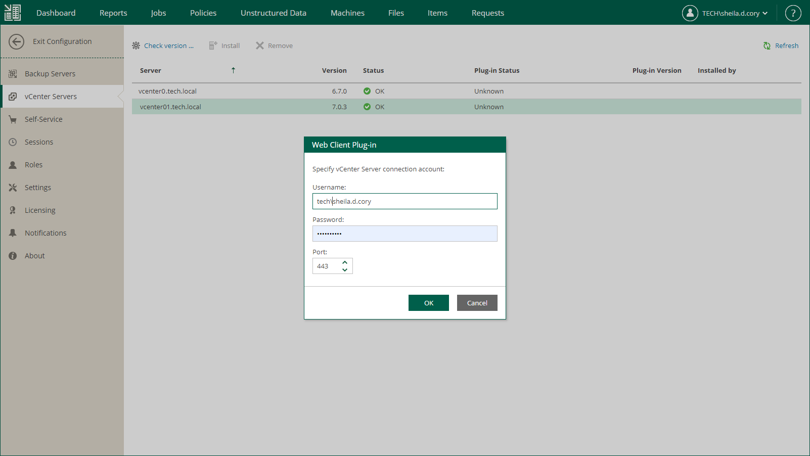

# Installing vSphere Client Plug-in

To install Veeam Plug-in for VMware vSphere Client, take the following steps:

1. Log in to Veeam Backup Enterprise Manager using an account with the Portal Administrator role.
2. Click Configuration in the upper-right corner.
3. In the Configuration view, go to the vCenter Servers section.
4. Select the vCenter Server you need, and click Check version.
5. In the Web Client Plug-in window, enter a user name and password to connect to the vCenter Server, and specify a connection port (default port is 443). Veeam Backup Enterprise Manager will use these credentials to access the vCenter Server and check if Veeam plug-in has been already installed there. If discovered, the plug-in version will be displayed in the Plug-in Version column.
6. If the connection to vCenter Server is successful, and the plug-in has not been installed yet, then the Install link will become active. Click it to install the plug-in.
7. After installation, the plug-in will be displayed in the list of vCenter Servers and plug-ins.

