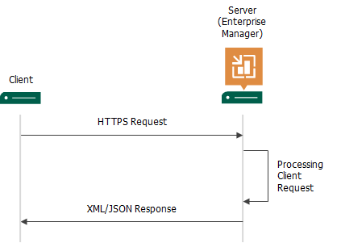

In this article

REST API relies on the client-server model:

1. The client makes requests to the Veeam Backup Enterprise Manager server, over the HTTPS protocol.
2. The server processes the request and returns either a successful operation status or error. In case of success, the server returns a response in the form of an XML or JSON document.
3. The client accepts the response, parses it and retrieves the information it needs from the response.

Page updated 5/22/2025

Page content applies to build 13.0.1.1071
