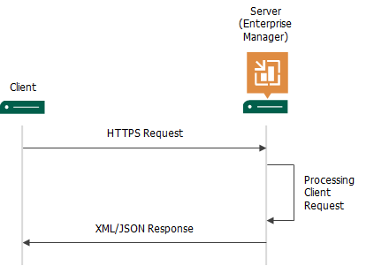

# Client-Server Model

The REST API relies on the client-server model:

1. The client makes requests to the Veeam Backup Enterprise Manager server over the HTTPS protocol.
2. The server processes the request and returns either a success status or an error. If the request is successful, the server returns a response body in the XML or JSON format.
3. The client receives the response, parses it and retrieves the required information.

