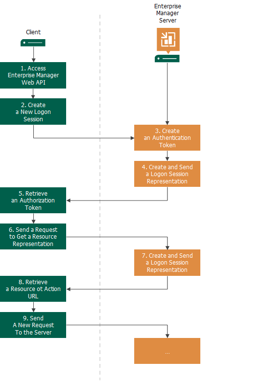

In this article

The workflow of communication with Veeam Backup Enterprise Manager REST API typically includes the following steps:

1. The client accesses Veeam Backup Enterprise Manager REST API by its base URL https://<Enterprise-Manager>:9398/api/.
2. The client creates a new logon session and sends to the server user credentials to authenticate the user who plans to work with Veeam Backup Enterprise Manager REST API.
3. The server creates a new [authentication token](http_authentication.md) for the logon session.
4. The server returns a resource representation of the logon session to the client:

* In the header of the logon session representation, the server returns the authorization token — an ID of the created logon session.
* In the body of the logon session representation, the server returns a list of links for resources with which the client can work.

1. The client retrieves the authorization token from the server response.
2. The client retrieves a URL of the necessary resource from the server response and sends the GET HTTP request for the URL to get a representation of this resource. In the header of the request, the client sends the obtained authorization token.
3. The server returns a resource representation to the client.
4. The client parses the response and retrieves the information it needs from the received response. Typically, it is a URL of another resource or action the client wants to perform with the resource.
5. Using the retrieved URL and the necessary HTTP verb, the client composes a new request to the server and so on and so forth.

|  |
| --- |
| Important |
| The authorization token issued by Veeam Backup Enterprise Manager should be passed in the header of every request. For details, see the [HTTP Authentication](http_authentication.md) section. |

Page updated 5/22/2025

Page content applies to build 13.0.1.1071
