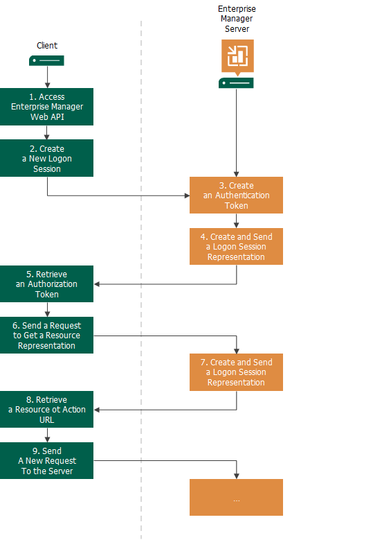

# Workflow

The communication workflow with the Veeam Backup Enterprise Manager REST API typically includes the following steps:

1. The client accesses the REST API by its base URL https://<Enterprise-Manager>:9398/api/.
2. The client creates a new logon session and sends user credentials to the server to authenticate the user who will work with the REST API.
3. The server creates [an authentication token](http_authentication.md) for the logon session.
4. The server returns a resource representation of the logon session to the client:

* In the response header, the server returns the authorization token — the ID of the created logon session.
* In the response body, the server returns a list of links to resources that the client can access.

1. The client extracts the authorization token from the server response.
2. The client extracts a URL of the necessary resource from the server response and sends a GET request to retrieve a representation of this resource. In the request header, the client includes the obtained authorization token.
3. The server returns a representation of the requested resource.
4. The client parses the response and extracts the information it needs. Typically, it is a URL of another resource or an action to perform on the current or related resource.
5. Using the retrieved URL and the necessary HTTP method, the client sends the next request, and repeats this process as needed.

|  |
| --- |
| Important |
| The authorization token issued by Veeam Backup Enterprise Manager should be passed in the header of every request. For details, see [HTTP Authentication](http_authentication.md). |

