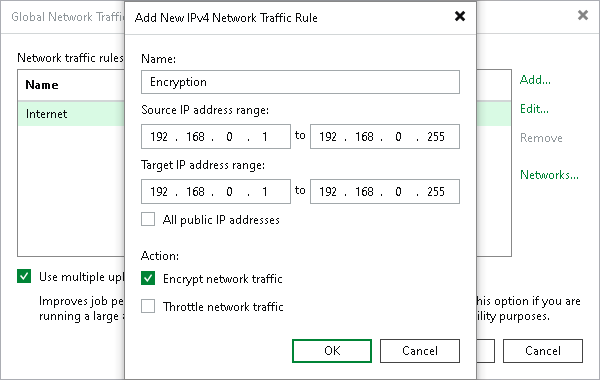

# Enabling Traffic Encryption

By default, Veeam Backup & Replication encrypts backup network traffic transferred between public networks. For details, see [Adjusting Internet Rule](internet_rule.md).

|  |
| --- |
| Note |
| By default, “public networks” are defined as any networks whose IP ranges differ from 10.0.0.0/8, 172.16.0.0/12, 192.168.0.0/16, and fc00::/7 (RFC1918 and unique local addresses). If you require encryption for backup network traffic between components communicating over private networks (for example, those within the ranges above), you must configure a custom network rule to enable traffic encryption for these networks. |

Network rules also allow you to encrypt backup data transfer connections between [Veeam Data Movers](veeam_transport_service.md) in private networks. Network traffic encryption is provided by TLS connection and configured as the part of global network traffic rules that are set for backup infrastructure components.

For more information about supported TLS versions and cipher suites, see [Supported Cipher Suites and Protocols](cipher_suites_protocols.md#encrypted_communication).

To create a network rule with traffic encryption:

1. From the main menu, select Network Traffic Rules.
2. In the Name field, specify a name for the rule.
3. In the Global Network Traffic Rules window, click Add and select an IPv4 or IPv6 rule. Note that you can add the IPv6 rule only if the Enable IPv6 communication check box is selected. For more information, see [IPv6 Support](ipv6.md).
4. In the Source IP address range section, specify a range of IP addresses for backup infrastructure components on the source site.
5. In the Target IP address range section, specify a range of IP addresses for backup infrastructure components on the target site.
6. Select the Encrypt network traffic check box.

|  |
| --- |
| Note |
| If encryption is enabled on a backup job level, backup data will be encrypted before sending. For more information, see [Job Encryption](encryption_job.md). |

Related Topics

[Communications Encryption](communications_encryption.md)

