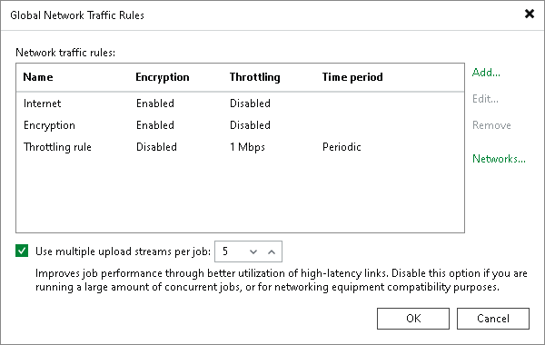

# Managing Upload Streams

By default, Veeam Backup & Replication uses multithreaded data transfer for every job session. VM data going from source to target is transferred over 5 TCP/IP connections. However, if you schedule several jobs to run at the same time, load on the network may be heavy. If the network capacity is not sufficient to support multiple data transfer connections, you can disable multithreaded data transfer or change the number of TCP/IP connections.

To change the number of connections:

1. From the main menu, select Network Traffic Rules.
2. In the Global Network Traffic Rules window, specify new data transfer settings:

+ To disable multithreaded data transfer, clear the Use multiple upload streams per job check box. Veeam Backup & Replication will use only one TCP/IP transfer connection for every job session.
+ To change the number of TCP/IP connections, leave the Use multiple upload streams per job check box selected and specify the necessary number of connections in the field on the right.

|  |
| --- |
| Note |
| Consider the following:   * The minimum number of TCP/IP connections supported by Veeam Backup & Replication is 1, the maximum number is 100. * If the Use multiple upload streams per job check box is enabled, Veeam Backup & Replication performs a CRC check for the TCP traffic going between the source and the target. The check works when you perform data protection and recovery operations, except for restores that involve mount activities such as guest OS file restore and Instant Recovery. Veeam Backup & Replication calculates checksums for data blocks going from the source. On the target, it recalculates checksums for received data blocks and compares them to the checksums created on the source. If the CRC check fails, Veeam Backup & Replication automatically re-sends data blocks without any impact on the job. If you disable the Use multiple upload streams per job check box, the CRC check also becomes disabled. * [For Veeam Plug-Ins for Enterprise Applications] The multithreaded data transfer setting does not affect backup jobs created by Veeam Plug-In for Oracle RMAN/SAP HANA/SAP on Oracle. To configure multiple channels for backup and restore operations for these plug-ins, see [Databases and Enterprise Applications](protect_applications.md). |

