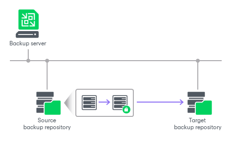
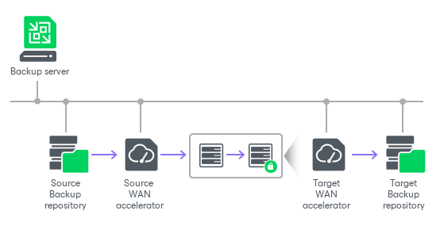
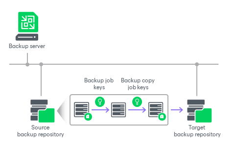

# Encrypting Backup Copy Jobs

The encryption process for a backup job includes the following steps:

1. Job encryption is configured in the [advanced job settings](backup_copy_settings_storage.md). When you enable the encryption option, you need to enter a password or select a KMS server.
2. If you enter a password, Veeam Backup & Replication generates a secret key. If you select a KMS server, Veeam Backup & Replication asks the KMS server to generate an asymmetric KMS key. A secret key or a KMS key will be used to encrypt data encryption keys during the job.  For more information, see [How Backup Data Encryption Works](encryption_hiw.md).
3. When you start a job, Veeam Backup & Replication encrypts backup files with data encryption keys. By default, this operation is performed on the source backup repository.
4. Encrypted data is passed to the target backup repository and stored to a resulting backup file.

|  |
| --- |
| Note |
| If you plan to store backups in [Veeam Data Cloud Vault](osr_adding_veeam_data_cloud_vault.md), you must enable job encryption. |

If you use WAN accelerators for backup copy jobs, the encryption process is performed on the target WAN accelerator.

An encrypted backup copy job may use an encrypted backup file as a source. In this situation, Veeam Backup & Replication decrypts encrypted source backup file, encrypts it again and and transfers to the target backup repository. Even if encryption is disabled in the backup copy job, Veeam Backup & Replication will decrypt data blocks of the encrypted source backup files.

If you update encryption settings for an existing backup copy job, consider the following:

* If you enable encryption, during the next job session Veeam Backup & Replication will automatically create a full backup file. The created full backup file and subsequent incremental backup files in the backup chain will be encrypted with the specified password or KMS key.

Note that Veeam Backup & Replication does not encrypt the previous backup chain created by this job. If you want to start a new chain so that the unencrypted previous chain can be separated from the encrypted new chain, follow [this Veeam KB article](https://www.veeam.com/kb1885).

* If you change the password or start using KMS keys for the already encrypted job, during the next job session Veeam Backup & Replication will create a new incremental backup file. The created backup file and subsequent backup files in the backup chain will be encrypted with the new password or KMS key.
* If you disable encryption, during the next job session Veeam Backup & Replication will automatically create a full backup file.

