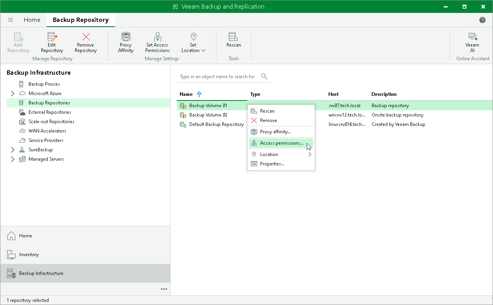
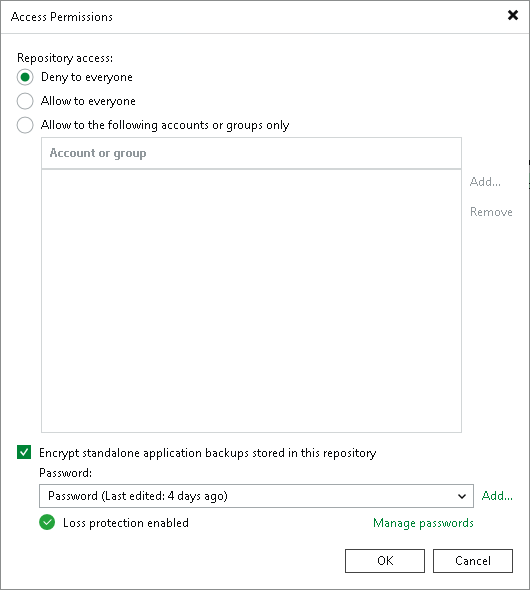

# Encrypting Standalone Application Backups in Backup Repositories

In this article

At the storage encryption level, you can encrypt backup files created by the following standalone applications:

* Veeam Agents operating in the standalone mode
* Veeam Plug-Ins for Enterprise Applications operating in the standalone mode
* Veeam Plug-In for Nutanix AHV
* Veeam Plug-In for Proxmox VE
* Veeam Backup for OLVM and RHV\*
* Veeam Kasten for Kubernetes

* Veeam Plug-In for Scale Computing HyperCore

\*This feature is available for Microsoft Windows-based backup servers.

Veeam Backup & Replication encrypts files at the standalone application side in the following way:

| Backup Repository | Encryption |
| --- | --- |
| Regular backup repository:   * Microsoft Windows/Linux-based repository * NFS file share * SMB (CIFS) file share * Object storage repository * Deduplicating storage appliance | Backup files are encrypted before uploading to the backup repository. To encrypt backup files, a standalone application uses encryption password specified in the Access Permissions settings. For more details, see [Enabling Encryption for Standalone Application Backups](#enable_encryption). |
| Scale-out repository | Backup files are encrypted before uploading to the scale-out backup repository.  To encrypt backup files before uploading to a performance tier, a standalone application uses encryption password specified in the Access Permissions settings for the scale-out backup repository. For more details, see [Enabling Encryption for Standalone Application Backups](#enable_encryption).  To encrypt backup files before uploading to a capacity or archive tier, a standalone application uses encryption password specified in the capacity tier settings. For more details, see [Adding Scale-Out Backup Repositories](sobr_add.md).  If you enable encryption both in the capacity tier settings and in the Access Permissions settings for the scale-out backup repository, backup files will be encrypted twice before uploading to a capacity or archive tier. |

Requirements and Limitations

Consider the following:

* For backup files created by Veeam Agents operating in the standalone mode, data encryption with KMS keys is not supported. For more information, see [Key Management System Keys](kms.md).
* To encrypt backup files created by Veeam Agents operating in the managed mode, you must configure encryption in the backup job settings. For example, to learn how to encrypt backup files created by managed Veeam Agent for Microsoft Windows, see the [Storage Settings](agent_job_advanced_storage.md) section in Veeam Agent Backup.
* To encrypt backup files created by other platforms and applications, you must configure encryption in the backup job settings. For more information, see [Job Encryption](encryption_job.md).
* Data encryption has a negative effect on the deduplication ratio. If you want to achieve a higher deduplication ratio, use only deduplicating storage appliance encryption. For more details, see [Data Encryption and Deduplication](data_encryption.md#dedup).

Enabling Encryption for Standalone Application Backups

To encrypt standalone application backups, do the following:

1. Open the Backup Infrastructure view.
2. In the inventory pane, select the Backup Repositories or Scale-out Repositories node.

1. In the working area, select the necessary backup repository and click Set Access Permissions on the ribbon or right-click the backup repository and select Access permissions. If you do not see the Set Access Permissions button on the ribbon or the Access permissions command is not available in the shortcut menu, press and hold the [Ctrl] key, right-click the backup repository and select Access permissions.

1. In the Standalone applications window, select the Encrypt standalone application backups stored in this repository check box and choose the necessary password from the field under the check box. If you have not specified a password beforehand, click Add on the right or the Manage passwords link to add a new password.

Page updated 11/21/2025

Page content applies to build 13.0.1.1071
