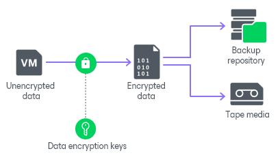
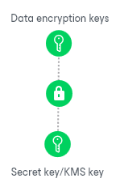

# How Backup Data Encryption Works

In this article

In Veeam Backup & Replication, data encryption for backup files works at the following levels:

* [Job encryption](encryption_job.md)
* [Storage encryption](encryption_storage.md)

When you enable data encryption, Veeam Backup & Replication encrypts backup files with data encryption keys, transfers encrypted data to the target side and stores it in a backup repository or a tape device.

Data Encryption Keys

To encrypt each type of backup files, Veeam Backup & Replication uses specific data encryption keys. These keys are encrypted with the secret key based on the password or KMS key and stored in the configuration database. Data encryption keys are not passed to the target side except for the following situations:

* You run a backup copy job over WAN accelerators.
* You perform health check for the encrypted backup files.
* You use tapes with enabled encryption. Depending on the encryption level, data encryption keys are passed to the tape library (hardware encryption) or to the tape server (software encryption).

When you enable encryption for the job or storage, you can select the encryption method you want to use — a password that will generate secret keys or an external KMS server that will generate KMS keys.

For secret keys, consider the following:

* Veeam Backup & Replication generates a symmetric secret key based on the password you specify in the encryption options. To create a strong password, follow the recommendations:

* The password must be at least 12 characters long.
* The password must contain uppercase and lowercase characters.
* The password must be a mixture of alphabetic, numeric and punctuation characters.
* The password must significantly differ from the password you used previously.
* The password must not contain any real information related to you, for example, date of birth, your pet’s name, your logon name, and so on.
* The password hint must not contain the password.
* The password must be updated regularly.

* To generate a secret key, Veeam Backup & Replication uses 600,000 HMAC-SHA256 iterations and a 512-bit salt according to [Recommendation for Password-Based Key Derivation](https://nvlpubs.nist.gov/nistpubs/Legacy/SP/nistspecialpublication800-132.pdf).
* To encrypt data encryption keys with secret keys, Veeam Backup & Replication uses the 256-bit AES with a 256-bit key length in the CBC mode. For more information, see [Advanced Encryption Standard (AES)](https://nvlpubs.nist.gov/nistpubs/FIPS/NIST.FIPS.197-upd1.pdf).

For KMS keys, consider the following:

* Asymmetric KMS keys are managed and rotated by an external KMS server. Veeam Backup & Replication only sends requests to the KMS server. For more information about KMS keys, see [Key Management System Keys](kms.md).

* To encrypt data encryption keys with KMS keys, Veeam Backup & Replication uses the RSA algorithm with a 4096-bit key length. For more information, see [RSA Cryptography Specifications](https://tools.ietf.org/html/rfc8017).

|  |
| --- |
| Note |
| If you have lost or forgotten a password or you cannot use KMS keys due to a KMS server failure, you will not be able to recover data from backups or tapes unless you use Enterprise Manager keys in the encryption process. For more information, see [Password Loss Protection](encryption_password_loss_protection.md). |

Data Encryption and Deduplication

Data encryption has a negative effect on the deduplication ratio if you use a deduplicating storage appliance as a target. Veeam Backup & Replication uses different data encryption keys for every job session. For this reason, encrypted data blocks sent to the deduplicating storage appliances appear as different, even though they may contain duplicate data. If you want to achieve a higher deduplication ratio, you can disable data encryption. If you still want to use encryption, you can enable the encryption feature on the deduplicating storage appliance itself.

Data Encryption and Compression

If data compression and data encryption are enabled for a job, Veeam Backup & Replication compresses VM data first and after that encrypts the compressed data blocks. Both operations are performed at the source side.

If the Decompress backup data blocks before storing check box is selected in the backup repository settings, Veeam Backup & Replication does not compress VM data before encryption. Therefore, in the job statistics, you may observe a higher amount of transferred data (the Transferred counter) as compared to a job for which encryption is disabled. For details on job statistics, see [Viewing Real-Time Statistics](realtime_statistics.md).

Page updated 12/22/2025

Page content applies to build 13.0.1.1071
