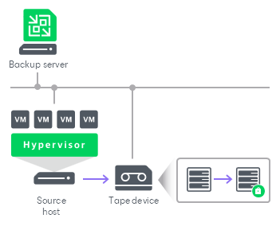
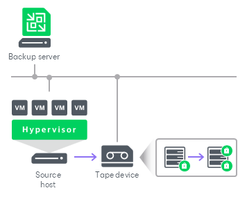

# Tape Encryption

Veeam Backup & Replication supports the following encryption levels for tape media:

* Hardware level: library- and driver-managed encryption mechanisms provided by the tape vendor.
* Software level: the encryption mechanism provided by Veeam Backup & Replication.

How Data Encryption Works

Data encryption on tapes includes the following steps:

1. You enable encryption in the [media pool settings](add_media_pool_encryption.md) and select the encryption method you want to use — a password that will generate secret keys or an external KMS server that will generate KMS keys. For more information about these encryption methods, see the [Data Encryption Keys](https://helpcenter.veeam.com/docs/backup/vsphere/encryption_hiw.html#data-encryption-keys) section in the Veeam Backup & Replication User Guide.
2. You select the media pool as a target for a tape job.
3. Veeam Backup & Replication generates specific data encryption keys to protect data archived to tape.
4. When the tape job starts, Veeam Backup & Replication checks what encryption level should be used:

* Hardware encryption has a higher priority. If hardware encryption is enabled for the tape library, Veeam Backup & Replication will use it by default.
* If hardware encryption is not supported by the tape library or disabled, Veeam Backup & Replication will use software encryption.

1. During the tape job, data encryption keys are passed to the target side:

* If hardware encryption is used, Veeam Backup & Replication passes data encryption keys to the tape library. The tape library uses its mechanism to encrypt data on tapes.
* If software encryption is used, Veeam Backup & Replication passes data encryption keys to the tape server and encrypts data when it is archived to tape.

|  |
| --- |
| Note |
| If you have lost or forgotten a password or you cannot use KMS keys due to a KMS server failure, you will not be able to recover data from backups or tapes unless you use Enterprise Manager keys in the encryption process. For more information, see [Decrypting Tapes With Enterprise Manager Keys](tape_decrypt_no_password.md). |

How Double Data Encryption Works

Backup to tape jobs allow double data encryption. The backup to tape job uses a backup file as a source of data. If the backup file is encrypted with the initial backup job and the backup to tape job uses a media pool with enabled encryption, the resulting backup file will be encrypted twice. For more information on how to decrypt such backup files, see [Restoring Encrypted Data from Tapes](tapes_restore_encrypted.md).

Related Topics

[Restoring Encrypted Data from Tapes](tapes_restore_encrypted.md)

