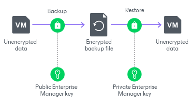

# Enterprise Manager Keys

Enterprise Manager keys make up a pair of matching keys — a keyset. Keysets are created and managed on the Veeam Backup Enterprise Manager server. During installation of Veeam Backup Enterprise Manager, the setup automatically generates a new keyset containing a public Enterprise Manager key and a private Enterprise Manager key. You can use Veeam Backup Enterprise Manager to create new Enterprise Manager keysets, activate them, import and export keysets and specify retention for their lifetime. For more information, see the [Managing Encryption Keys](https://helpcenter.veeam.com/docs/vbr/em/em_manage_keys.html?ver=13) section in the Veeam Backup Enterprise Manager User Guide.

If you enable password loss protection, the public Enterprise Manager key is automatically sent to the backup server and stored in the configuration database. When Veeam Backup & Replication encrypts backup files, it uses a secret key or a KMS key and a public Enterprise Manager key simultaneously.

|  |
| --- |
| Note |
| Consider the following:   * To generate Enterprise Manager keys, Veeam Backup Enterprise Manager uses the RSA algorithm with a 4096-bit key length. For more information, see [RSA Cryptography Specifications](https://tools.ietf.org/html/rfc8017).  * To encrypt data encryption keys with Enterprise Manager keys, Veeam Backup & Replication uses the RSA algorithm with a 4096-bit key length.  * Public Enterprise Manager keys stored in the configuration database are encrypted with specific data protection mechanisms. For more information, see [How Database Data Encryption Works](encryption_database_hiw.md). |

The private Enterprise Manager key is used to decrypt data encrypted with the public Enterprise Manager key. Private Enterprise Manager keys are not distributed and stored only on Veeam Backup Enterprise Manager.

For Enterprise Manager keysets, consider the following recommendations:

* Create and activate new Enterprise Manager keysets regularly.
* Export your Enterprise Manager keysets and keep them in a safe place. If your installation of Veeam Backup Enterprise Manager goes down for some reason, you will lose private Enterprise Manager keys. As a result, you will not be able to use the password loss protection.
* If a matching private Enterprise Manager key is not found in the Veeam Backup Enterprise Manager configuration database, the decryption process will fail. In such situations, you can import the private key manually. For more information, see the [Exporting and Importing Enterprise Manager Keyset](https://helpcenter.veeam.com/docs/vbr/em/em_export_import_keys.html?ver=13) section in the Veeam Backup Enterprise Manager Guide.

