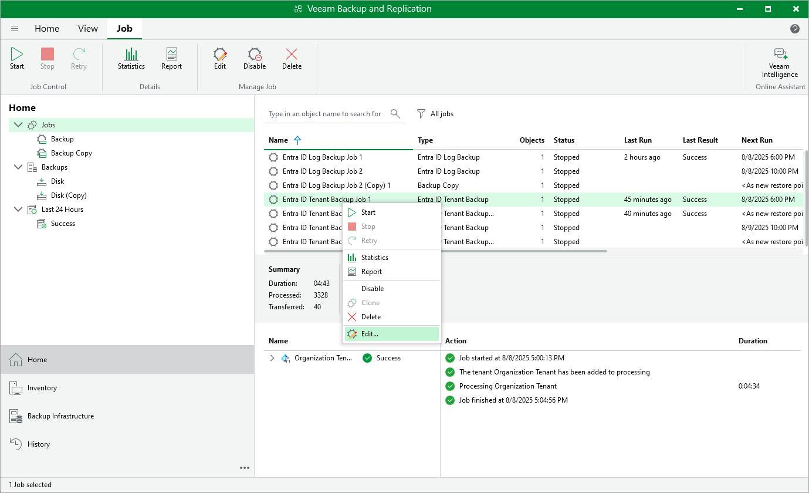

# Editing Backup Job Settings

For each backup job, you can modify the settings configured while creating the job:

1. Open the Home view and navigate to Jobs > Backup.
2. In the working area, select the job and click Edit on the ribbon.

Alternatively, you can right-click the job and select Edit.

1. Edit the necessary job settings as follows:

* To provide a new name and description for the job, follow the instructions provided in section [Creating Tenant Backup Jobs](entra_id_job_name.md) (step 2) or [Creating Log Backup Jobs](entra_id_log_job_name.md) (step 2).
* To modify the list of resources that you want to protect, or change the repository that is used to store the backup files, follow the instructions provided in section [Creating Tenant Backup Jobs](entra_id_job_tenant.md) (step 3) or [Creating Log Backup Jobs](entra_id_log_job_repo.md) (step 4).
* To modify the compression, encryption, notification or health check settings, follow the instructions provided in section [Creating Tenant Backup Jobs](entra_id_tenant_backup_advanced_settings.md) (step 3) or [Creating Log Backup Jobs](entra_id_log_job_advanced.md) (step 4).
* To instruct Veeam Backup & Replication to create additional backup copies, follow the instructions provided in section [Creating Tenant Backup Jobs](entra_id_tenant_backup_copy.md) (step 4) or [Creating Log Backup Jobs](entra_id_log_job_secondary.md) (step 5).
* To modify the schedule configured for the policy, follow the instructions provided in section [Creating Tenant Backup Jobs](entra_id_job_schedule.md) (step 5) or [Creating Log Backup Jobs](entra_id_log_job_schedule.md) (step 6).
* At the Summary step of the wizard, review configuration information and click Finish to confirm the changes.

You will follow the same steps you followed when creating the job and can change job settings as required.

