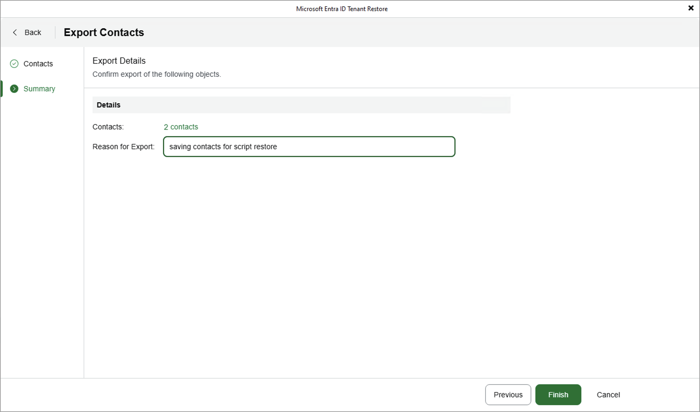

# Exporting Item Data

Veeam Backup for Microsoft Entra ID allows you to export tenant item properties and metadata (including permissions, relationships and memberships) from a backup and save the exported data as a number of .JSON files that you can further use to process the data with 3rd party scripts.

To export item data, do the following:

1. Select the necessary item and click Export JSON. Alternatively, right-click the item and select Restore > Export JSON.

You can export data of multiple items at a time — in this case, Veeam Backup & Replication will save the data of each item as an individual .JSON file to the default download directory on the local machine. However, keep in mind that your selection is discarded when you switch between tabs since exporting different item types simultaneously is not supported.

|  |
| --- |
| Note |
| You can tell .JSON files created by Veeam Backup for Microsoft Entra ID from other files in your default download directory by their names — the name of every .JSON file with exported item data will contain the object ID of that item. |

1. Complete the Export wizard:

1. By default, Veeam Backup & Replication uses the most recent valid restore point when exporting item data. However, you can export item data from an earlier restore point — to do that, select an item at the Details step of the wizard, click Restore Point and choose the necessary restore point in the Specify restore point window.

You can choose one restore point for multiple items. However, if the chosen restore point does not exist for any of the selected items, Veeam Backup for Microsoft Entra ID will display a warning notifying that the requested value was not found and will use the closest available restore point for these items instead.

|  |
| --- |
| Tip |
| If you want to adjust the export scope, you can click Upload CSV to import the list of items that you have previously exported at [step 2](entra_id_tenant_restore_items.md). Keep in mind that you will have to manually modify the .CSV file to remove all columns except Id (or Id and DisplayName for users) before uploading the file — otherwise, Veeam Backup & Replication will not be able to process the file properly. |

1. At the Summary step of the wizard, review configuration information, specify a reason for exporting item data and click Finish. The specified reason will be saved to the session history, and you will be able to reference it later.

Note that it may take up to 30 minutes for Veeam Backup for Microsoft Entra ID to create the .JSON file.

Page updated 2026-06-22

