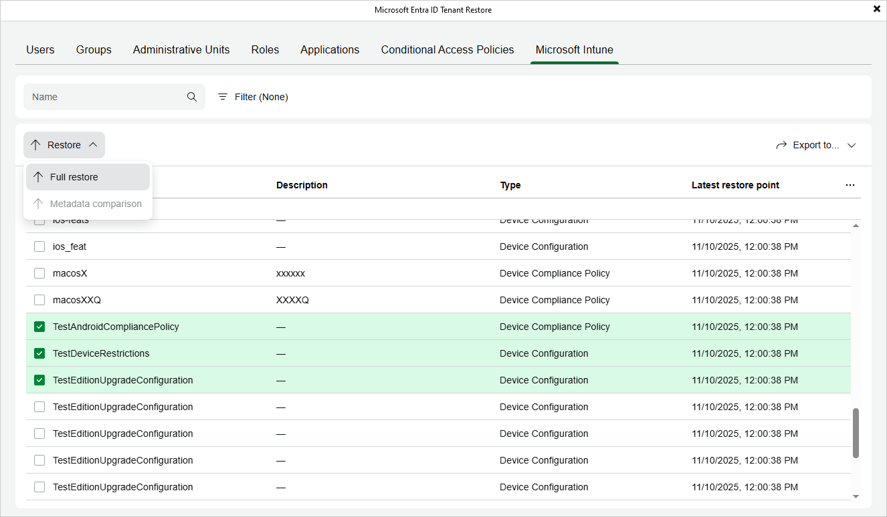

# Step 2. Choose Items to Restore

In the Microsoft Entra ID Tenant Restore wizard, switch to the necessary tab and then do either of the following:

* If you want to restore an item, select this item and click Restore > Full restore. Alternatively, right-click the item and select Restore > Full restore.

Veeam Backup for Microsoft Entra ID allows you to restore multiple items at a time. However, keep in mind that your selection is discarded when you switch between tabs since restoring different item types simultaneously is not supported.

* If you want to restore properties of an item, select this item and click Restore > Metadata comparison. Alternatively, right-click the item and select Restore > Metadata comparison.

Veeam Backup for Microsoft Entra ID allows you to restore multiple properties at a time. However, keep in mind that restoring properties of different items simultaneously is not supported.

Veeam Backup for Microsoft Entra ID does not support restore of contacts (neither internal nor external) or devices of tenants across your organization — you can only export their properties and metadata as described in section [Exporting Tenant Data](entra_id_restore_to_json.md).

|  |
| --- |
| TipS |
| * You can narrow down the list of items available on the selected tab by applying a number of filters. To do that, either use the search field or click Filter (if available). You can use SQL wildcard characters % and \_ for item names search. * You can export the list of filtered items to further use it for any internal purposes or if you decide to add items to the [restore](entra_id_tenant_restore_point.md) or [export](entra_id_restore_to_json.md) scope. To do that, click Export to and select the necessary format. Veeam Backup & Replication will save the file with the exported data to the default download directory on the local machine. |

Page updated 2026-06-30

