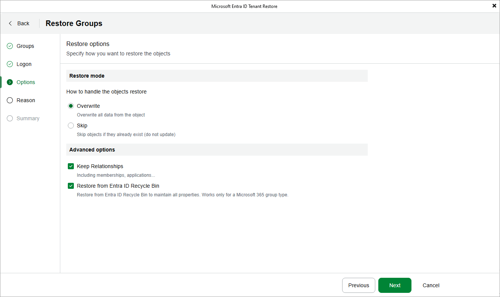

# Configuring Advanced Options

In the Advanced options section, choose whether you want to restore not only the processed items themselves but also their relationships. Additionally, you can instruct Veeam Backup for Microsoft Entra ID to use data temporarily stored in the  Entra ID Recycle Bin to perform the restore operation.

Restoring Item Relationships

When processing an item added to the restore scope, Veeam Backup for Microsoft Entra ID restores the list of relationships that the original item had when the selected restore point was created. To change this behavior, clear the Keep Relationships check box — in this case, the product will restore this item without preserving its relationships.

Keep in mind that Veeam Backup for Microsoft Entra ID restores only those relationships associated with items that still exist in the production environment. Also, the list of relationships that Veeam Backup for Microsoft Entra ID can restore depends on the restore scope:

Restoring Item Relationships

| Items | Relationships |
| Users | * Role assignments * Group memberships * Group ownerships * Administrative unit memberships * Application ownerships * Assignments to managers * Assignments to direct reports |
| Groups | * Role assignments * Group memberships * Administrative unit memberships * User memberships * User ownerships |
| Administrative units | * Role assignments * Group memberships * User memberships |
| Roles | * Assignments to groups * Assignments to users |
| Applications | * Ownerships |
| Service principals | * Ownerships  * User memberships * Group memberships  * Application representations |

|  |
| --- |
| Note |
| Restoring item relationships is not supported for conditional access policies. |

Restoring from Entra ID Recycle Bin

When restoring an item that still exists in the production environment, Veeam Backup for Microsoft Entra ID checks whether this item is stored in the Entra ID Recycle Bin. If the item is detected both in the Recycle Bin and in the backup, the product restores the item from the Recycle Bin and preserves its object ID by default. To change this behavior, clear the Restore from Entra ID Recycle Bin check box — in this case, the product will restore the item using the backed-up data and will assign a new object ID to it.

To learn how Microsoft Entra ID retains data in the Recycle Bin, see [Microsoft Docs](https://learn.microsoft.com/en-us/entra/identity/hybrid/connect/how-to-connect-sync-recycle-bin).

