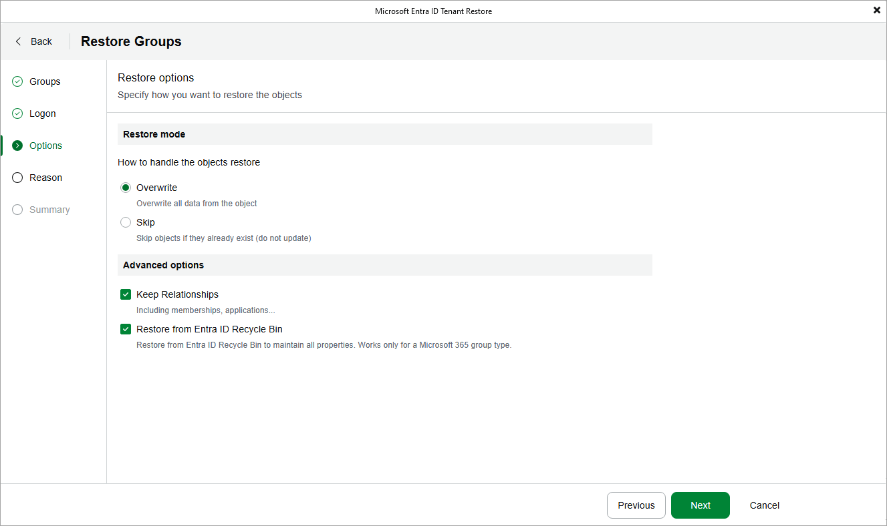

# Adding Application Certificates

[This step applies only if you have chosen to restore applications when proceeding with the wizard]

When processing an application added to the restore scope, Veeam Backup for Microsoft Entra ID does not recover its certificates. For the restored application to be able to authenticate in Microsoft Entra ID, at least one certificate must be manually uploaded for this application — to do that, click Add Application Certificates and browse to the necessary certificate file on the local machine. If you have not downloaded the application certificate beforehand, you can create a new certificate as described in [Microsoft Docs](https://learn.microsoft.com/en-us/entra/identity-platform/how-to-add-credentials?tabs=certificate).

Page updated 2026-07-14

