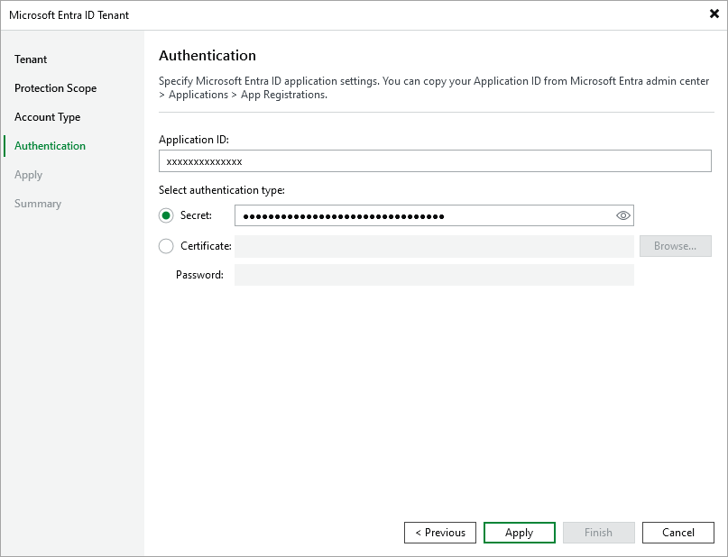

# Specifying Existing Application

This step applies only if you have selected the Use the existing account option at the [Account Type](entra_id_tenant_connection.md) step of the wizard.

To use an existing Microsoft Entra ID application:

1. In the Application ID field, specify the ID of the necessary application. The Microsoft Entra ID application must have permissions listed in [Permissions](entra_id_permissions.md).
2. In the Select authentication type area, choose if you want to use password-based authentication (application secret) or certificate-based authentication. Then provide the necessary information.

For more information on how to get tenant and application IDs, a secret and a certificate, see [Microsoft Docs](https://learn.microsoft.com/en-us/azure/active-directory/develop/howto-create-service-principal-portal#get-tenant-and-app-id-values-for-signing-in).

