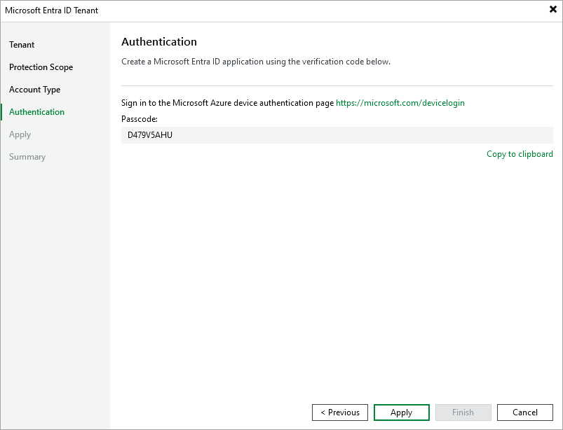

# Creating New Application

This step applies only if you have selected the Create a new account option at the [Account Type](entra_id_tenant_connection.md) step of the wizard.

If you choose to create a new account, Veeam Backup & Replication registers a new Microsoft Entra ID application for the specified Microsoft Entra ID tenant. Veeam Backup & Replication will use this application to authenticate to Microsoft Azure and will grant this application all the permissions necessary to process the selected protection scope. For more information on Microsoft Entra ID applications, see [Microsoft Docs](https://learn.microsoft.com/en-us/entra/identity-platform/app-objects-and-service-principals?tabs=browser). To create the Microsoft Entra ID application, you must use a single-use verification code that Veeam Backup & Replication provides you.

At the Authentication step of the wizard, do the following:

1. Click Copy to clipboard to copy the verification code.
2. Click the <https://microsoft.com/devicelogin> link.
3. On the Microsoft Azure device authentication page, do the following:

1. Paste the code that you have copied and click Next. Note that the code will expire in 15 minutes.
2. Specify a Microsoft Azure account that will be used to create an application. Note that the user name must be specified in the [user principal name format](https://docs.microsoft.com/en-us/azure/active-directory/hybrid/plan-connect-user-signin#user-sign-in-and-user-principal-name) (username@domain). The account must have permissions described in section [Permissions](entra_id_permissions.md).

1. Go back to the Entra ID Tenant wizard.
2. Click Apply and check whether any errors occurred during the authentication process.

