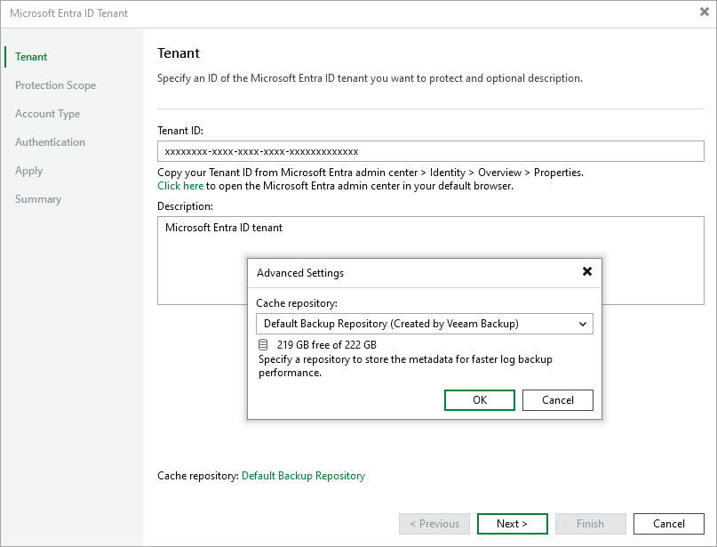

# Step 2. Specify Tenant ID and Cache Repository

In this article

At the Tenant step of the wizard, specify the GUID of a Microsoft Entra ID tenant whose resources you plan to back up and provide a description for future reference.

You can also choose a repository where Veeam Backup & Replication will store temporary cache files while performing data protection and disaster recovery operations. By default, these files are stored on the PostgreSQL instance running the configuration database; however, you can specify another repository to distribute backup traffic — to do that, click Cache and select the necessary repository in the Advanced Settings window. For a repository to be displayed in the Cache repository list, it must be added to the backup infrastructure as described in in the Veeam Backup & Replication User Guide, section [Backup Repositories](https://helpcenter.veeam.com/docs/vbr/userguide/backup_repository.html?ver=13).

Page updated 9/3/2025

Page content applies to build 13.0.1.1071
