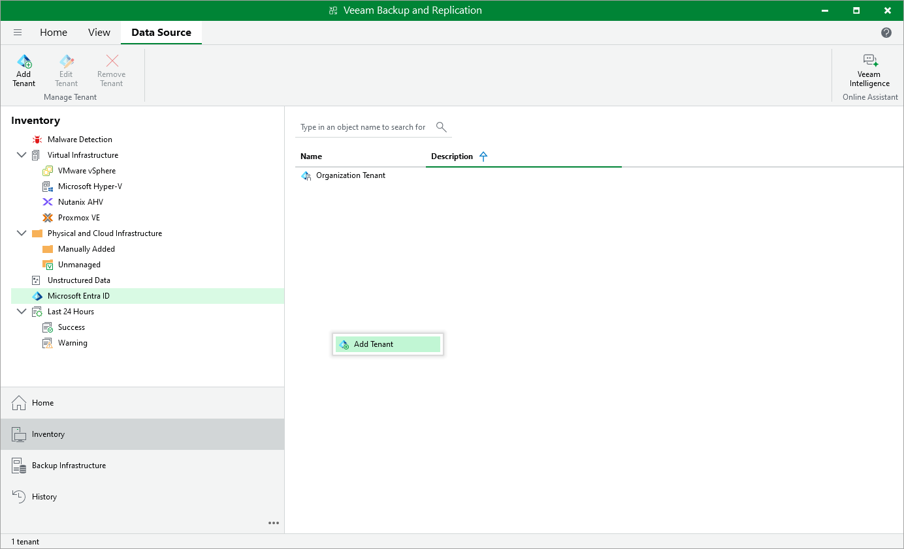

# Step 1. Launch Microsoft Entra ID Tenant Wizard

To launch the Microsoft Entra ID Tenant wizard, do the following:

1. Open the Inventory view.
2. In the inventory pane, click the Microsoft Entra ID node.
3. Right-click the Microsoft Entra ID node and select Add Microsoft Entra ID tenant.

Alternatively, click Add Tenant on the ribbon.

