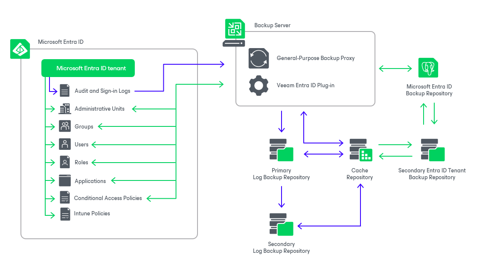

# Solution Architecture

The Veeam Backup for Microsoft Entra ID architecture comprises the following set of components:

* [Backup server](#server)
* [General-purpose backup proxy](#proxy)
* [Microsoft Entra ID backup repository](#psql_db)
* [Log backup repositories](#repositories)
* [Cache repository](#cache_repository)

Backup Server

A backup server is a physical or virtual machine on which Veeam Backup & Replication is installed. The backup server is the configuration, administration and management core of the backup infrastructure. It coordinates backup and restore operations, controls job scheduling and manages resource allocation. In addition to its primary functions, backup server also performs the role of a general-purpose backup proxy — an architecture component that processes jobs and transfers data to and from backup repositories.

For more information on the backup server, see the Veeam Backup & Replication User Guide, sections [Backup Server](https://helpcenter.veeam.com/archive/vbr/13/userguide/backup_server.html) and  [General-Purpose Backup Proxies](https://helpcenter.veeam.com/docs/vbr/userguide/backup_proxy_general.html?ver=13).

Microsoft Entra ID Backup Repository

A Microsoft Entra ID backup repository is a PostgreSQL instance where Veeam Backup for Microsoft Entra ID stores backups of protected Microsoft Entra ID tenants. By default, Veeam Backup for Microsoft Entra ID uses the local PostgreSQL instance installed on the backup server. To ensure data safety, you can instruct Veeam Backup for Microsoft Entra ID to use a remote instance. For more information on the Microsoft Entra ID backup repository configuration, see [Configuring Repositories](entra_id_configure_repo.md).

Log Backup Repositories

A log backup repository is a storage location where Veeam Backup for Microsoft Entra ID stores backups of audit and sign-in logs of protected Microsoft Entra ID tenants.

To increase log availability and ensure that data can be recovered in case a disaster strikes, you can store backed-up data of audit and sign-in logs in different locations — primary and secondary log backup repositories with their own retention policies and encryption settings.

Cache Repository

A cache repository is a storage location where Veeam Backup for Microsoft Entra ID keeps temporary metadata to reduce the load on the backup server when performing backup operations. The cache repository keeps track of all log records that change between backup sessions.

|  |
| --- |
| Tip |
| To minimize network load during backup operations, it is recommended that you configure the cache repository to be located closer to the backup server in the computer network. |

