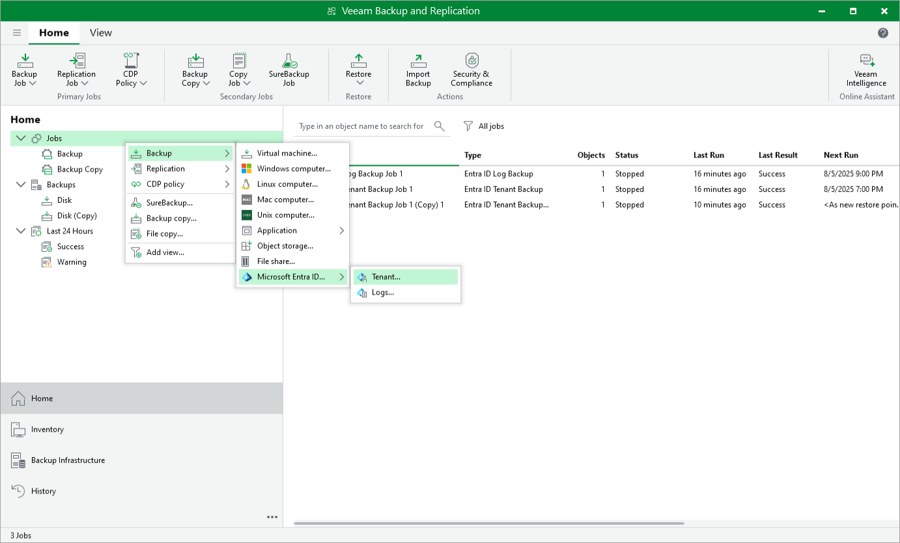

# Step 1. Launch New Microsoft Entra ID Tenant Backup Job Wizard

To launch the Microsoft Entra ID Tenant Backup Job wizard, do either of the following:

* Open the Home view. On the ribbon, click Backup Job > Microsoft Entra ID > Tenant.
* Open the Home view. In the inventory pane, right-click Jobs and select Backup > Microsoft Entra ID > Tenant.

