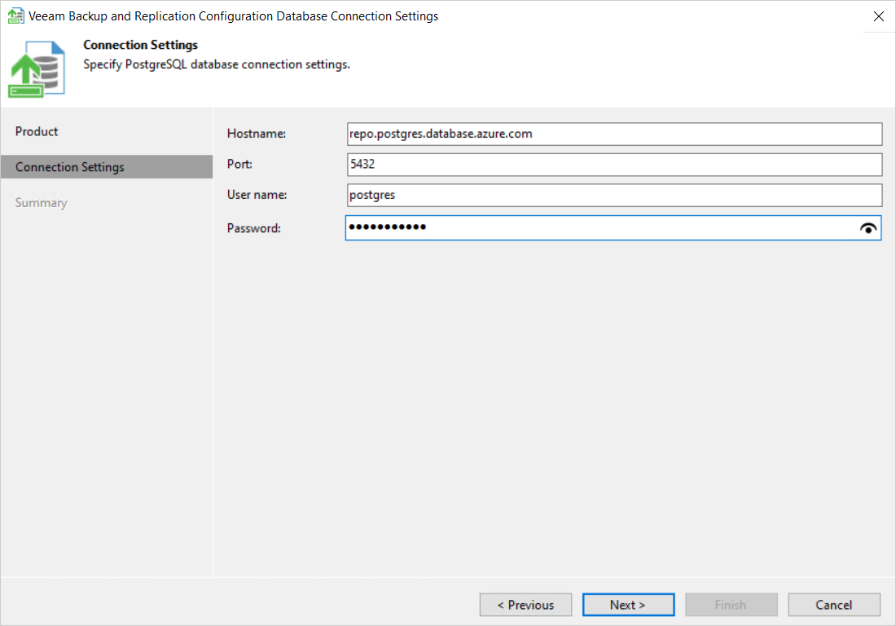

# Step 3. Configure Connection

In this article

At the Connection Settings step of the wizard, provide the connection settings for the PostgreSQL database server that will be used as a remote Microsoft Entra ID backup repository. Specify the host where the database instance is located, the port that will be used to connect to the database instance, and the credentials of the database account.

|  |
| --- |
| Important |
| You can connect to a PostgreSQL database using [PostgreSQL password authentication](https://www.postgresql.org/docs/17/auth-password.html) only. |

Page updated 11/5/2025

Page content applies to build 13.0.1.1071
